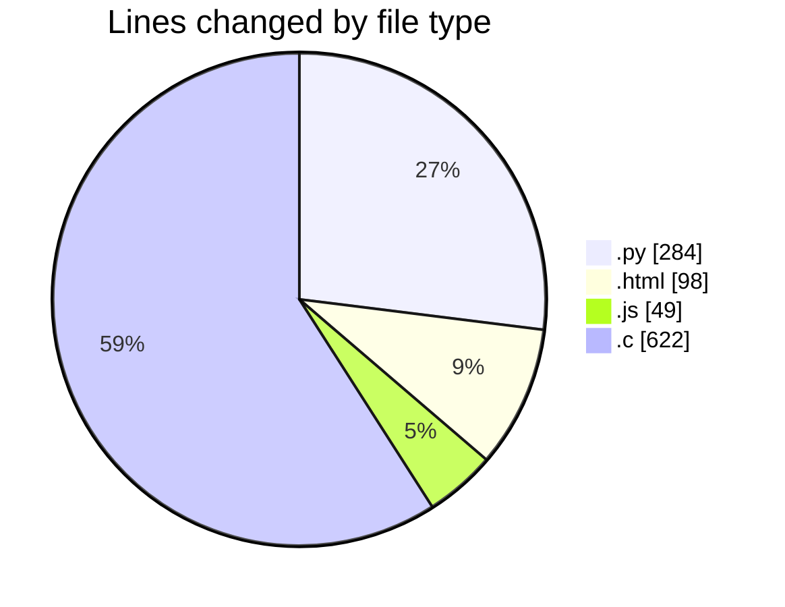
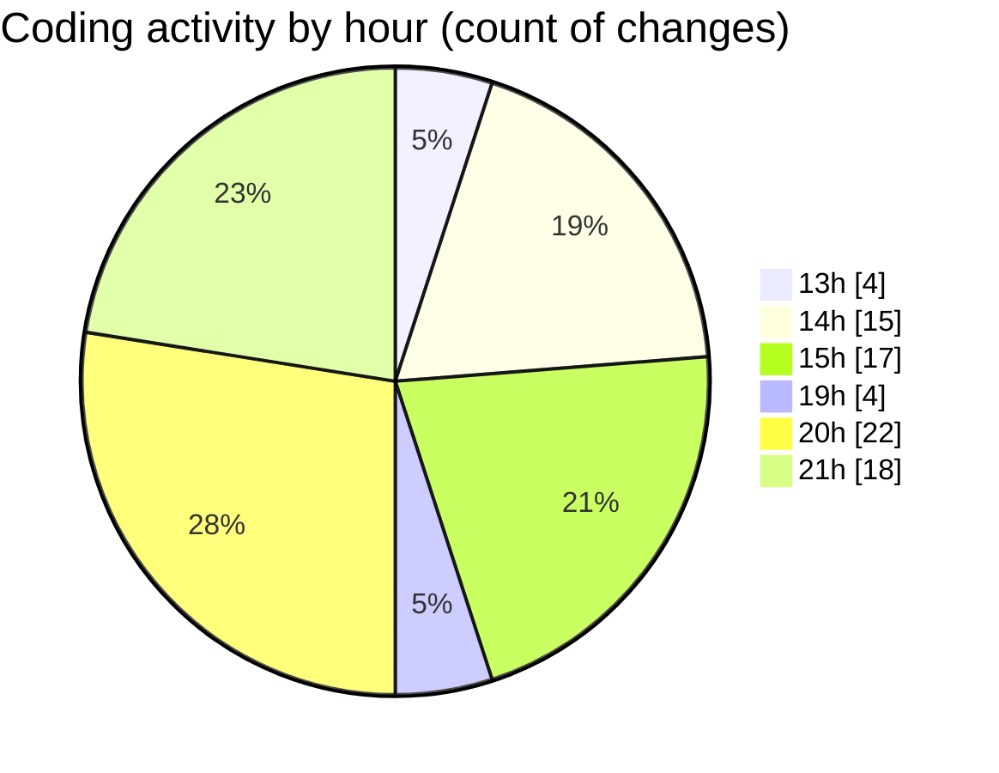

# Projects - Activity Summary 

## Overall Statistics

| Stat                   | Value                                                             |
| ---------------------- | ----------------------------------------------------------------- |
| **Lines Added** (➕)   | 805                                          |
| **Lines Removed** (➖) | 248                                        |
| **Net Change** (↕)    | 557                |
| **Active Time** (⌚)   | 91 minutes |

## Modified Files
- **explorer.py** (+243, -9)
- **app.py** (+1, -0)
- **index.html** (+1, -0)
- **app.py** (+28, -3)
- **index.html** (+48, -0)
- **server.js** (+1, -0)
- **index.html** (+1, -0)
- **utils.js** (+1, -0)
- **index.html** (+48, -0)
- **server.js** (+36, -0)
- **utils.js** (+11, -0)
- **cube.c** (+386, -236)

## Visualizations

### By File Type (Lines Changed)

### By Hour (Estimated Activity Count)

> **Last Updated:** 1/21/2025, 9:50:52 PM