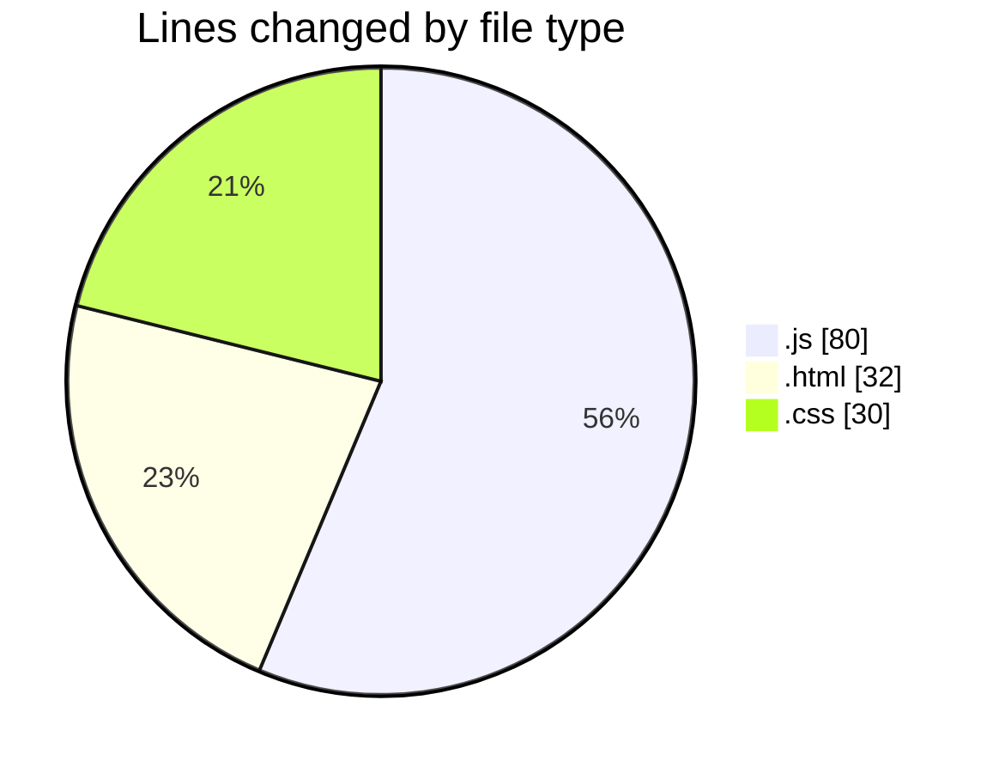
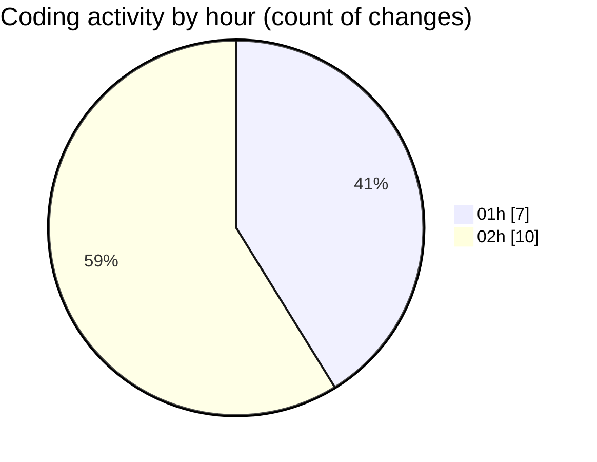

# Projects - Activity Summary 

## Overall Statistics

| Stat                   | Value                                                             |
| ---------------------- | ----------------------------------------------------------------- |
| **Lines Added** (➕)   | 138                                          |
| **Lines Removed** (➖) | 4                                        |
| **Net Change** (↕)    | 134                |
| **Active Time** (⌚)   | 24 minutes |

## Modified Files
- **newsService.js** (+1, -0)
- **config.js** (+1, -0)
- **NewsList.js** (+1, -0)
- **CategoryFilter.js** (+1, -0)
- **SearchBar.js** (+1, -0)
- **FavoriteArticles.js** (+1, -0)
- **App.js** (+1, -0)
- **index.html** (+32, -0)
- **styles.css** (+30, -0)
- **script.js** (+69, -4)

## Visualizations

### By File Type (Lines Changed)

### By Hour (Estimated Activity Count)

> **Last Updated:** 1/24/2025, 2:25:49 AM