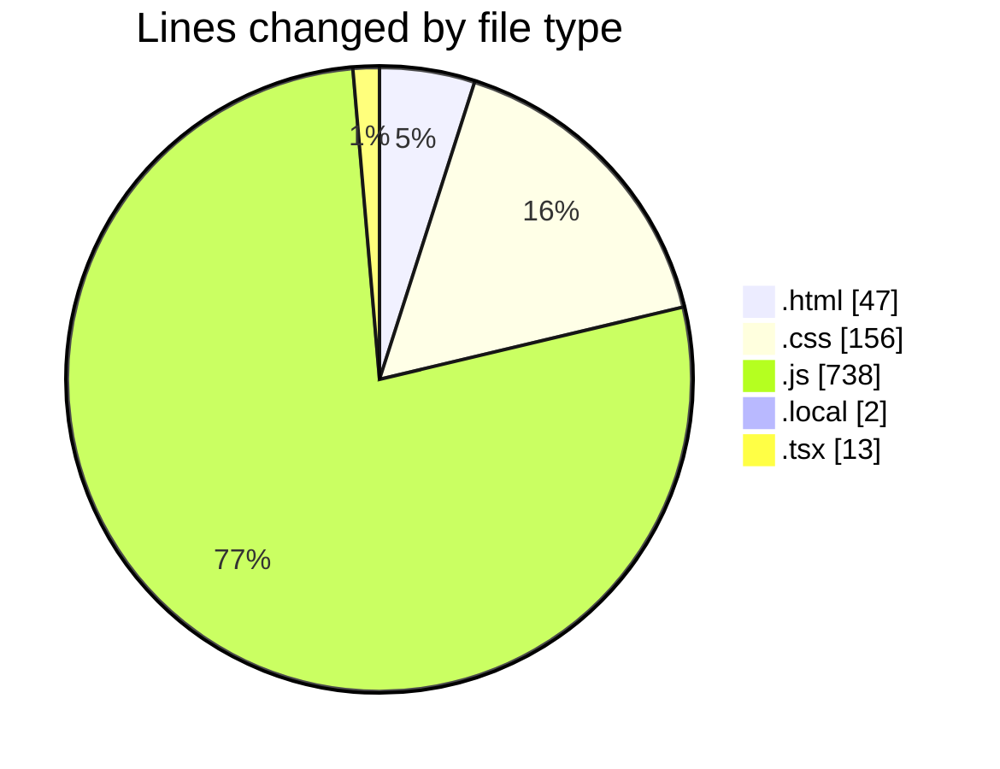
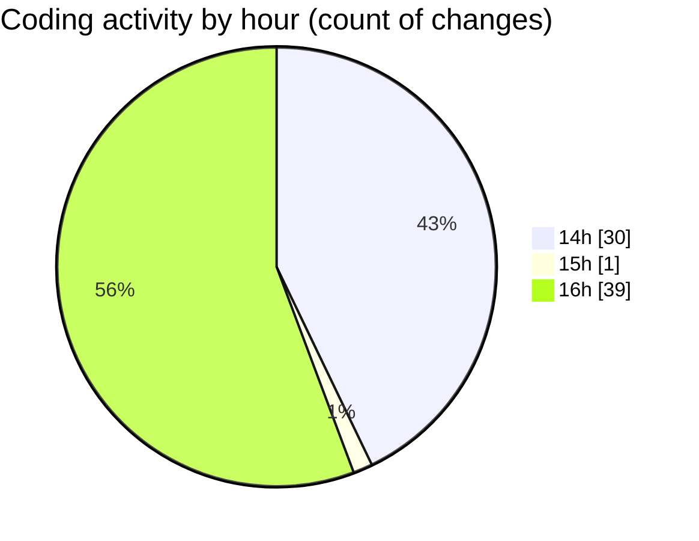

# Projects - Activity Summary 

## Overall Statistics

| Stat                   | Value                                                             |
| ---------------------- | ----------------------------------------------------------------- |
| **Lines Added** (➕)   | 844                                          |
| **Lines Removed** (➖) | 112                                        |
| **Net Change** (↕)    | 732                |
| **Active Time** (⌚)   | 67 minutes |

## Modified Files
- **index.html** (+47, -0)
- **style.css** (+117, -10)
- **script.js** (+268, -22)
- **mongodb.js** (+34, -9)
- **.env.local** (+2, -0)
- **route.js** (+74, -34)
- **route.js** (+40, -0)
- **page.js** (+96, -2)
- **page.js** (+116, -29)
- **globals.css** (+27, -2)
- **tailwind.config.js** (+12, -2)
- **layout.tsx** (+11, -2)

## Visualizations

### By File Type (Lines Changed)

### By Hour (Estimated Activity Count)

> **Last Updated:** 5/3/2025, 4:55:23 PM