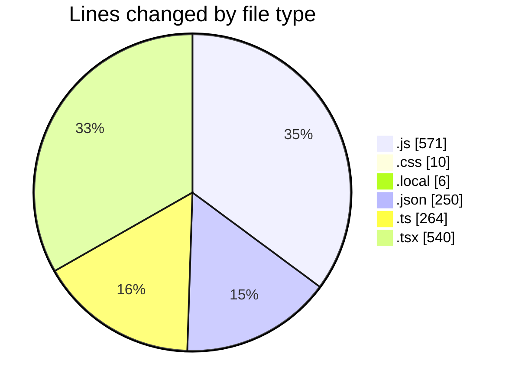
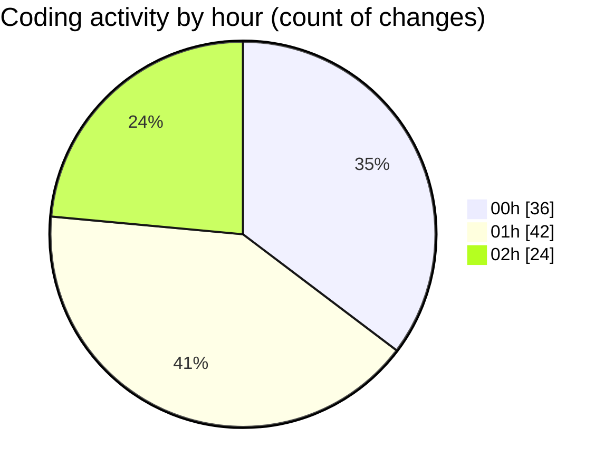

# HouseRentalService - Activity Summary 

## Overall Statistics

| Stat                   | Value                                                             |
| ---------------------- | ----------------------------------------------------------------- |
| **Lines Added** (➕)   | 1545                                          |
| **Lines Removed** (➖) | 96                                        |
| **Net Change** (↕)    | 1449                |
| **Active Time** (⌚)   | 144 minutes |

## Modified Files
- **tailwind.config.js** (+14, -3)
- **postcss.config.js** (+6, -2)
- **globals.css** (+8, -2)
- **.env.local** (+2, -0)
- **supabase.js** (+5, -0)
- **AuthContext.js** (+30, -0)
- **Header.js** (+33, -0)
- **Layout.js** (+10, -0)
- **_app.js** (+15, -0)
- **login.js** (+51, -0)
- **register.js** (+51, -0)
- **index.js** (+15, -0)
- **properties.js** (+86, -9)
- **[id].js** (+60, -0)
- **properties.js** (+34, -0)
- **post-property.js** (+121, -0)
- **postcss.config.js** (+11, -0)
- **package.json** (+26, -0)
- **package.json** (+3, -2)
- **.env.local** (+4, -0)
- **tsconfig.json** (+44, -2)
- **db.ts** (+33, -8)
- **route.ts** (+49, -0)
- **route.ts** (+63, -10)
- **Header.tsx** (+29, -0)
- **SearchBar.tsx** (+33, -0)
- **page.tsx** (+44, -10)
- **page.tsx** (+94, -0)
- **layout.tsx** (+53, -25)
- **auth.ts** (+34, -20)
- **tailwind.config.js** (+15, -0)
- **db.tsx** (+39, -3)
- **route.ts** (+38, -0)
- **page.tsx** (+72, -0)
- **page.tsx** (+82, -0)
- **PropertyCard.tsx** (+28, -0)
- **settings.json** (+173, -0)
- **auth.tsx** (+6, -0)
- **page.tsx** (+22, -0)
- **index.ts** (+9, -0)

## Visualizations

### By File Type (Lines Changed)

### By Hour (Estimated Activity Count)

> **Last Updated:** 5/4/2025, 2:22:56 AM