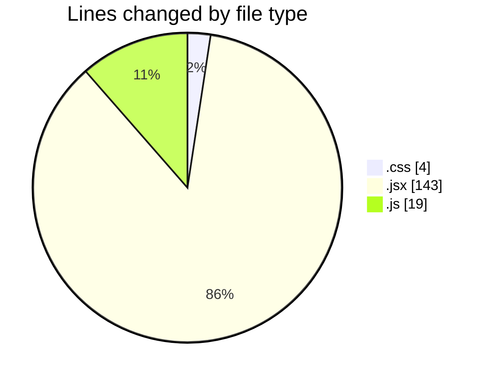
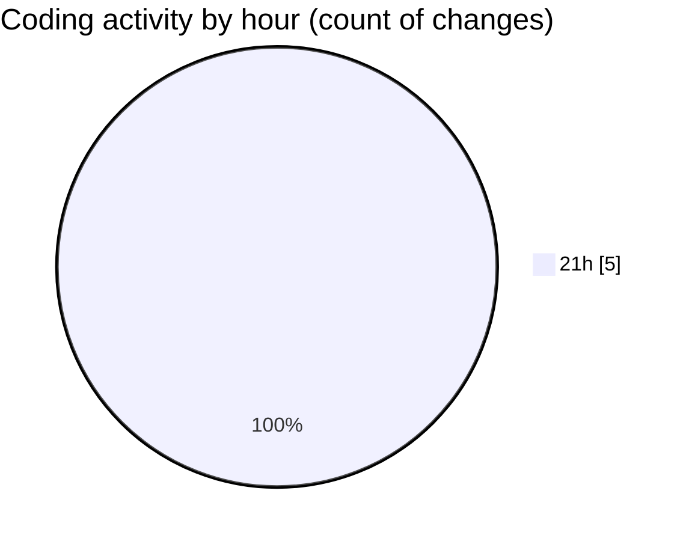

# AiExpenseTracker - Activity Summary 

## Overall Statistics

| Stat                   | Value                                                             |
| ---------------------- | ----------------------------------------------------------------- |
| **Lines Added** (➕)   | 166                                          |
| **Lines Removed** (➖) | 0                                        |
| **Net Change** (↕)    | 166                |
| **Active Time** (⌚)   | 3 minutes |

## Modified Files
- **index.css** (+4, -0)
- **main.jsx** (+11, -0)
- **App.jsx** (+132, -0)
- **tailwind.config.js** (+12, -0)
- **postcss.config.js** (+7, -0)

## Visualizations

### By File Type (Lines Changed)

### By Hour (Estimated Activity Count)

> **Last Updated:** 5/21/2025, 10:01:00 PM