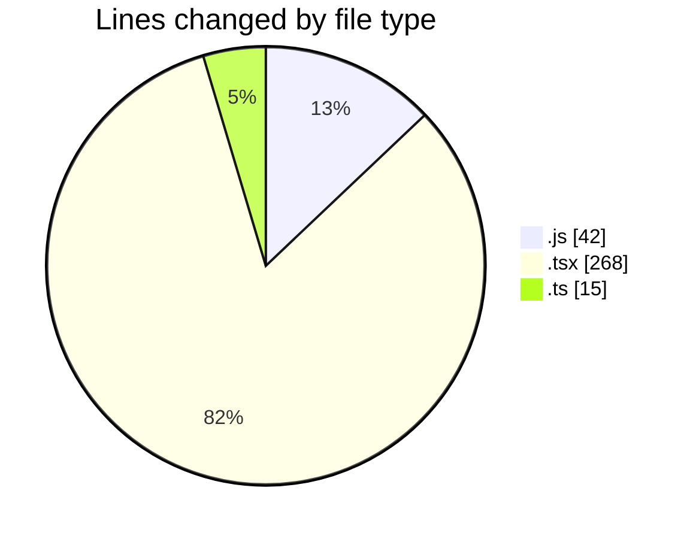
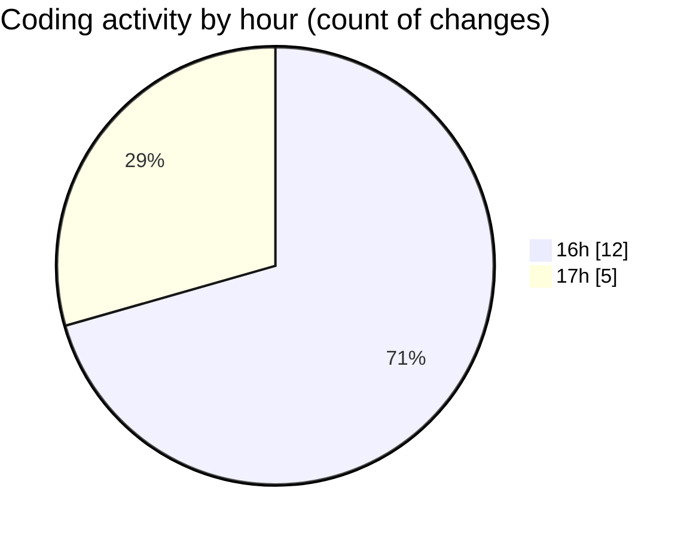

# ...Base - Activity Summary 

## Overall Statistics

| Stat                   | Value                                                             |
| ---------------------- | ----------------------------------------------------------------- |
| **Lines Added** (➕)   | 289                                          |
| **Lines Removed** (➖) | 36                                        |
| **Net Change** (↕)    | 253                |
| **Active Time** (⌚)   | 26 minutes |

## Modified Files
- **tailwind.config.js** (+8, -2)
- **babel.config.js** (+13, -6)
- **App.tsx** (+240, -28)
- **index.ts** (+15, -0)
- **metro.config.js** (+13, -0)

## Visualizations

### By File Type (Lines Changed)

### By Hour (Estimated Activity Count)

> **Last Updated:** 5/22/2025, 5:09:59 PM