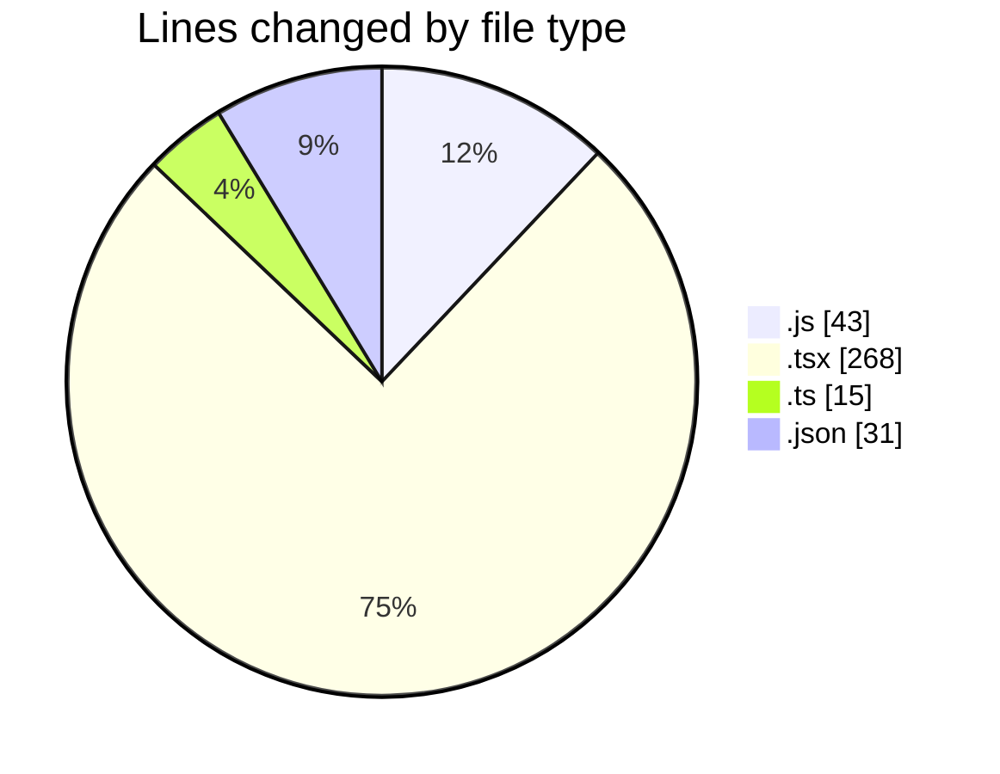
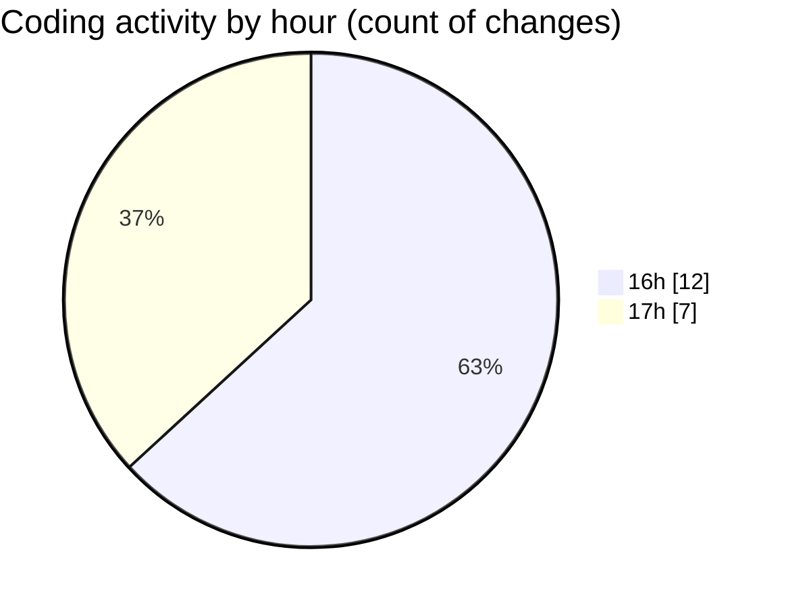

# ...Base - Activity Summary 

## Overall Statistics

| Stat                   | Value                                                             |
| ---------------------- | ----------------------------------------------------------------- |
| **Lines Added** (➕)   | 320                                          |
| **Lines Removed** (➖) | 37                                        |
| **Net Change** (↕)    | 283                |
| **Active Time** (⌚)   | 32 minutes |

## Modified Files
- **tailwind.config.js** (+8, -2)
- **babel.config.js** (+13, -7)
- **App.tsx** (+240, -28)
- **index.ts** (+15, -0)
- **metro.config.js** (+13, -0)
- **package.json** (+31, -0)

## Visualizations

### By File Type (Lines Changed)

### By Hour (Estimated Activity Count)

> **Last Updated:** 5/22/2025, 5:14:59 PM