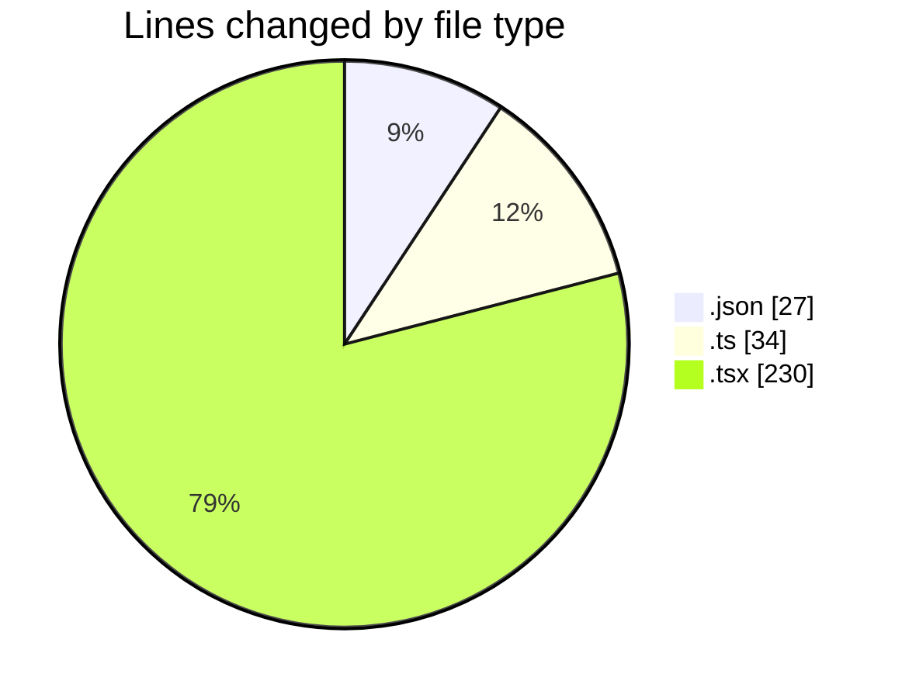
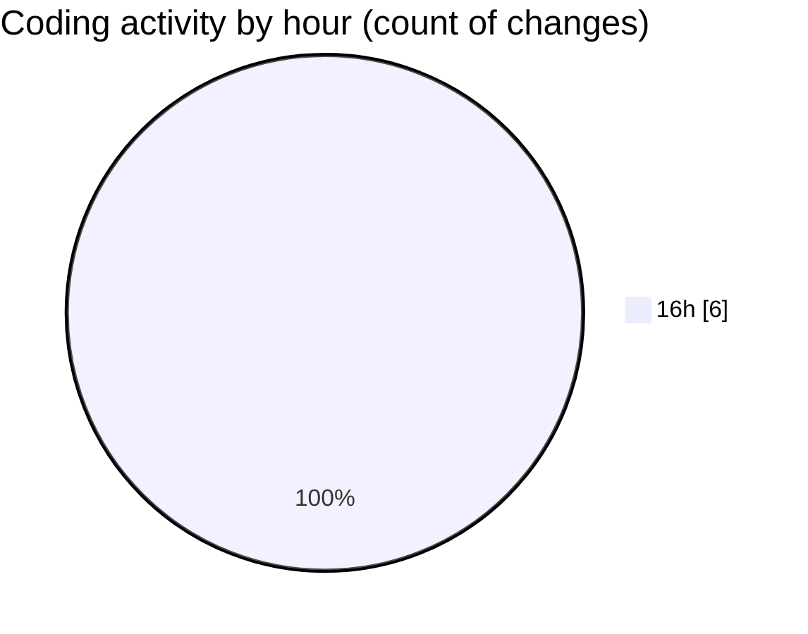

# AiExpenseTracker - Activity Summary 

## Overall Statistics

| Stat                   | Value                                                             |
| ---------------------- | ----------------------------------------------------------------- |
| **Lines Added** (➕)   | 291                                          |
| **Lines Removed** (➖) | 0                                        |
| **Net Change** (↕)    | 291                |
| **Active Time** (⌚)   | 5 minutes |

## Modified Files
- **package.json** (+27, -0)
- **index.ts** (+8, -0)
- **index.ts** (+26, -0)
- **AddExpenseScreen.tsx** (+100, -0)
- **HomeScreen.tsx** (+100, -0)
- **App.tsx** (+30, -0)

## Visualizations

### By File Type (Lines Changed)

### By Hour (Estimated Activity Count)

> **Last Updated:** 5/22/2025, 4:13:46 PM