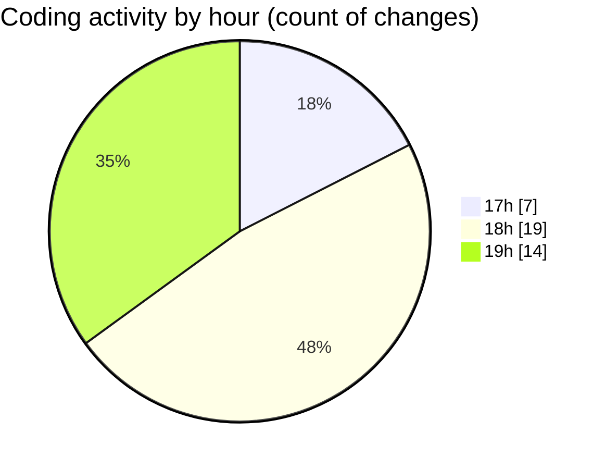

# ExpenseTracker - Activity Summary 

## Overall Statistics

| Stat                   | Value                                                             |
| ---------------------- | ----------------------------------------------------------------- |
| **Lines Added** (➕)   | 9423                                          |
| **Lines Removed** (➖) | 10                                        |
| **Net Change** (↕)    | 9413                |
| **Active Time** (⌚)   | 49 minutes |

## Modified Files
- **package.json** (+66, -7)
- **app.json** (+55, -0)
- **index.ts** (+46, -3)
- **App.tsx** (+218, -0)
- **package-lock.json** (+8896, -0)
- **App.js** (+21, -0)
- **index.jsx** (+33, -0)
- **add-expense.jsx** (+56, -0)
- **[expenseId].jsx** (+32, -0)

## Visualizations

### By File Type (Lines Changed)

### By Hour (Estimated Activity Count)

> **Last Updated:** 5/22/2025, 7:08:56 PM