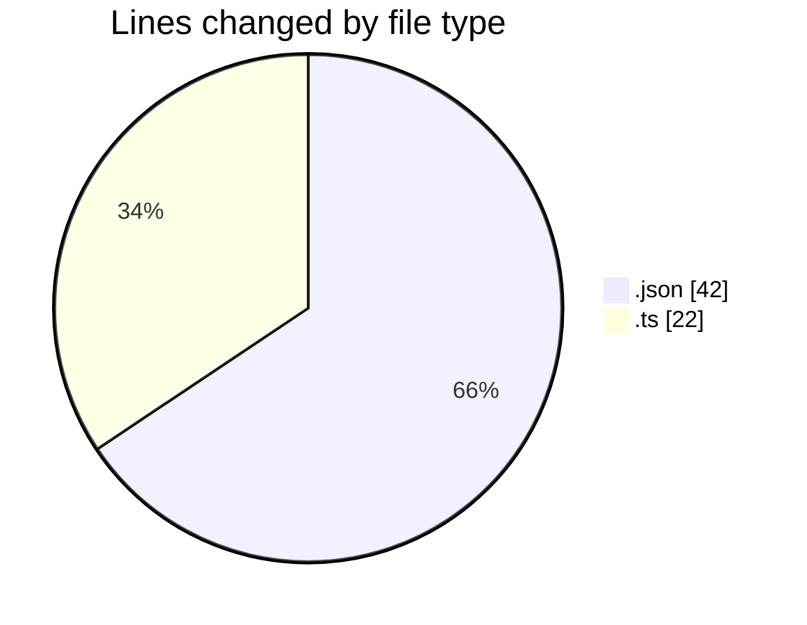
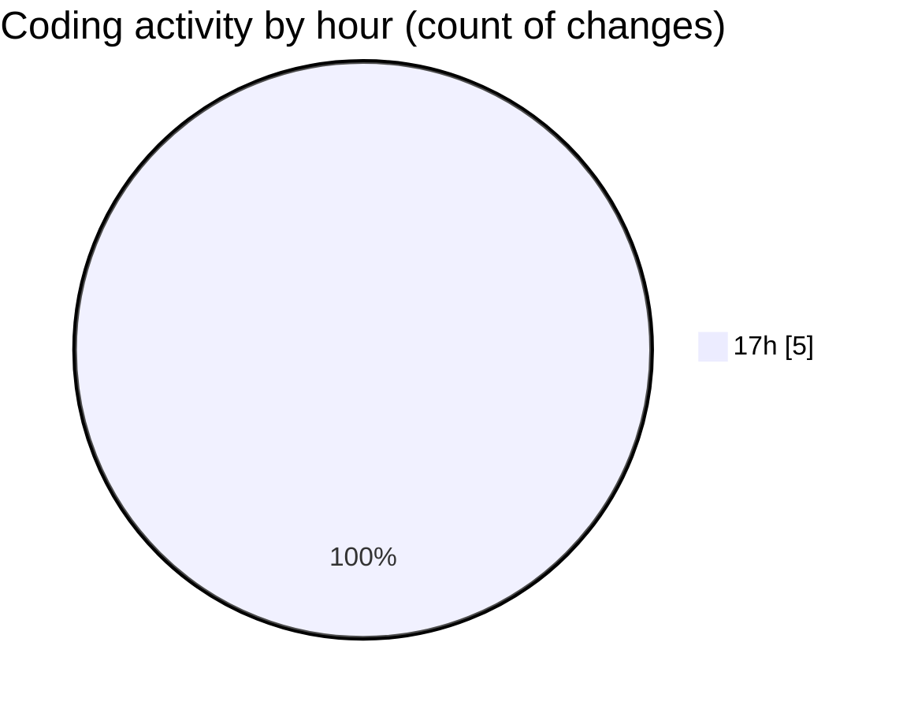

# ExpenseTracker - Activity Summary 

## Overall Statistics

| Stat                   | Value                                                             |
| ---------------------- | ----------------------------------------------------------------- |
| **Lines Added** (➕)   | 64                                          |
| **Lines Removed** (➖) | 0                                        |
| **Net Change** (↕)    | 64                |
| **Active Time** (⌚)   | 11 minutes |

## Modified Files
- **package.json** (+31, -0)
- **app.json** (+11, -0)
- **index.ts** (+22, -0)

## Visualizations

### By File Type (Lines Changed)

### By Hour (Estimated Activity Count)

> **Last Updated:** 5/22/2025, 5:33:03 PM