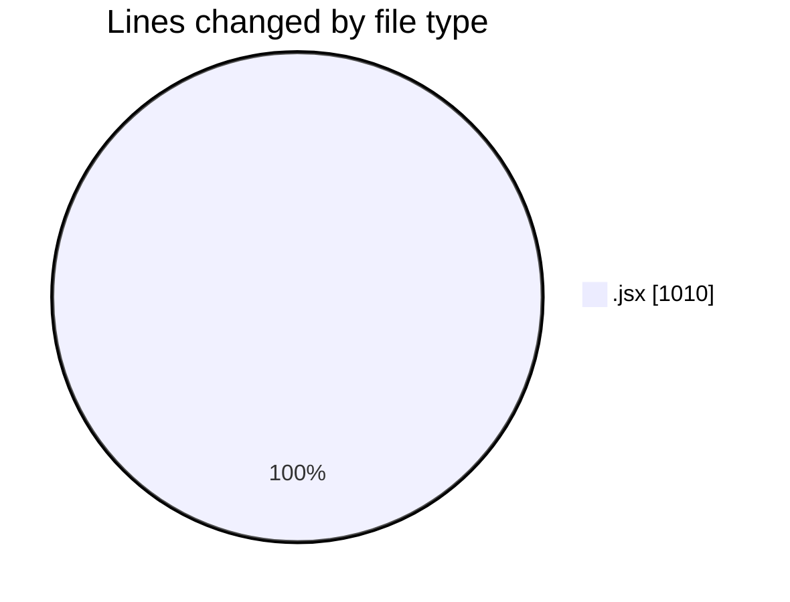
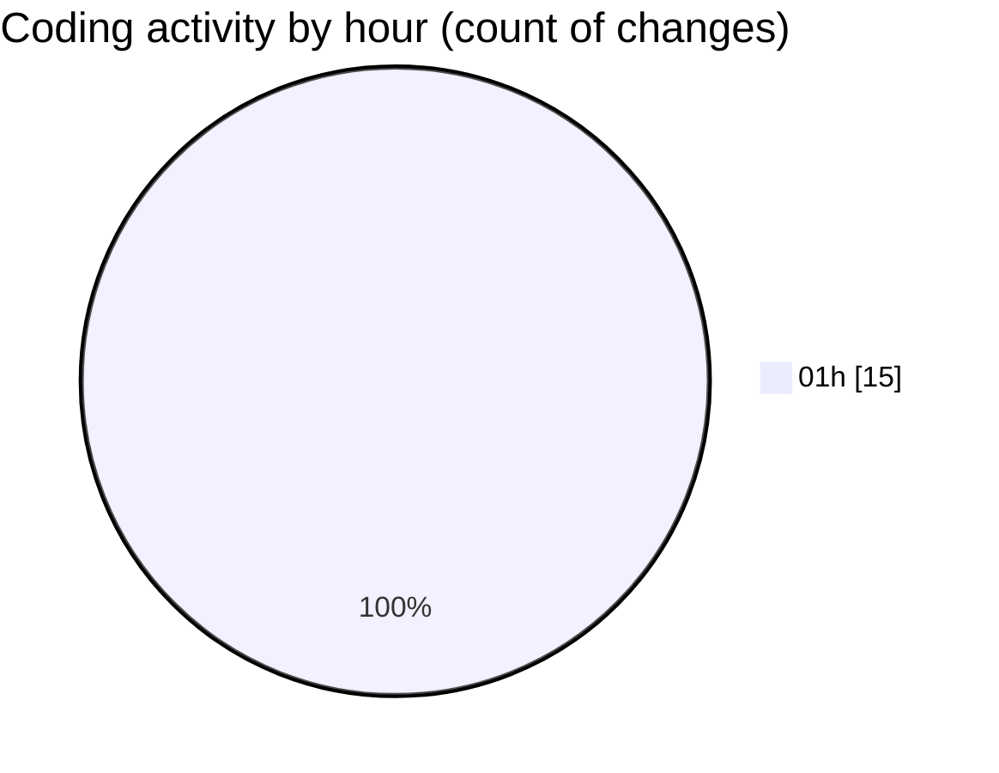

# ExpenseTracker - Activity Summary 

## Overall Statistics

| Stat                   | Value                                                             |
| ---------------------- | ----------------------------------------------------------------- |
| **Lines Added** (➕)   | 1010                                          |
| **Lines Removed** (➖) | 0                                        |
| **Net Change** (↕)    | 1010                |
| **Active Time** (⌚)   | 11 minutes |

## Modified Files
- **[expenseId].jsx** (+256, -0)
- **index.jsx** (+326, -0)
- **add-expense.jsx** (+213, -0)
- **add-entry.jsx** (+215, -0)

## Visualizations

### By File Type (Lines Changed)

### By Hour (Estimated Activity Count)

> **Last Updated:** 5/23/2025, 1:41:21 AM