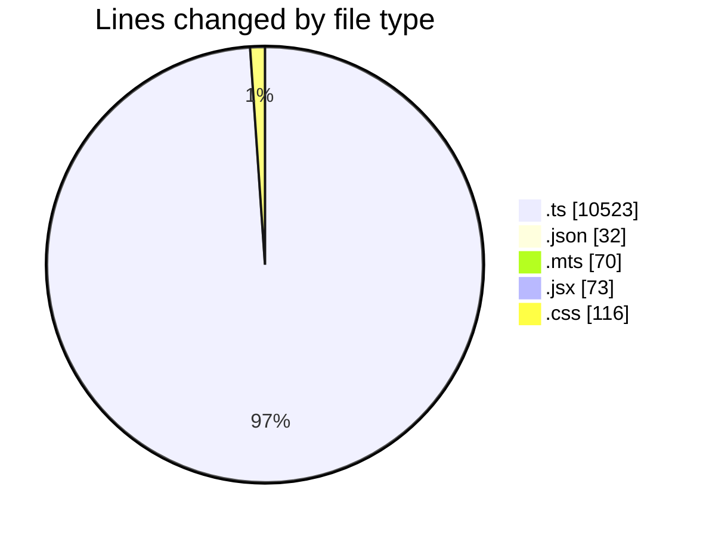
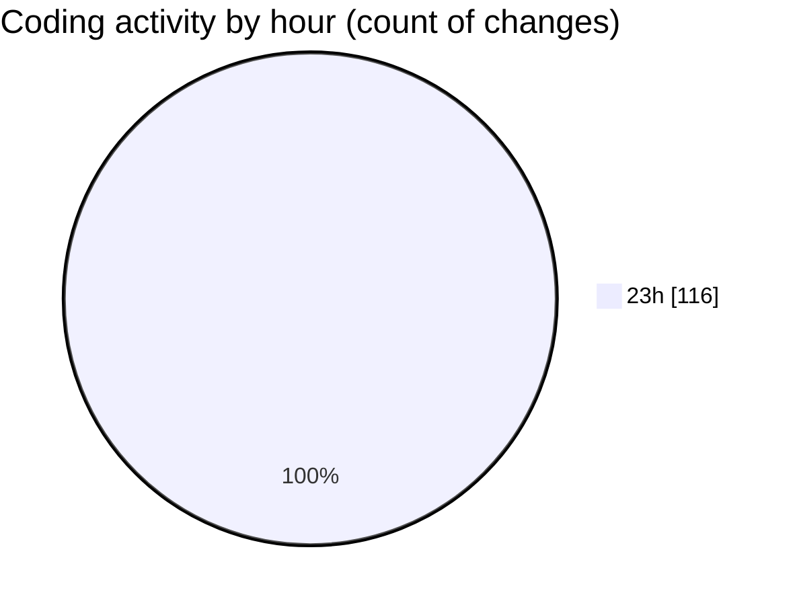

# Projects - Activity Summary 

## Overall Statistics

| Stat                   | Value                                                             |
| ---------------------- | ----------------------------------------------------------------- |
| **Lines Added** (➕)   | 10753                                          |
| **Lines Removed** (➖) | 61                                        |
| **Net Change** (↕)    | 10692                |
| **Active Time** (⌚)   | 121 minutes |

## Modified Files
- **index.d.ts** (+2, -0)
- **jsx-runtime.d.ts** (+37, -0)
- **use-at-your-own-risk.d.ts** (+88, -0)
- **index.d.ts** (+2296, -0)
- **package.json** (+30, -2)
- **jsx-runtime.d.ts** (+37, -0)
- **customEvent.d.ts** (+46, -0)
- **lazy-result.d.ts** (+191, -0)
- **root.d.ts** (+88, -0)
- **declaration.d.ts** (+152, -0)
- **css-syntax-error.d.ts** (+249, -0)
- **previous-map.d.ts** (+82, -0)
- **input.d.ts** (+207, -0)
- **module-runner.d.ts** (+291, -0)
- **hot.d.ts** (+40, -0)
- **moduleRunnerTransport.d-DJ_mE5sf.d.ts** (+88, -0)
- **no-work-result.d.ts** (+47, -0)
- **document.d.ts** (+70, -0)
- **node.d.ts** (+542, -0)
- **processor.d.ts** (+116, -0)
- **result.d.ts** (+206, -0)
- **warning.d.ts** (+148, -0)
- **postcss.d.ts** (+459, -0)
- **at-rule.d.ts** (+141, -0)
- **comment.d.ts** (+69, -0)
- **container.d.ts** (+481, -0)
- **rule.d.ts** (+127, -0)
- **postcss.d.mts** (+70, -0)
- **index.d.ts** (+4223, -0)
- **App.jsx** (+51, -22)
- **App.css** (+78, -37)
- **index.css** (+1, -0)

## Visualizations

### By File Type (Lines Changed)

### By Hour (Estimated Activity Count)

> **Last Updated:** 5/25/2025, 11:45:37 PM