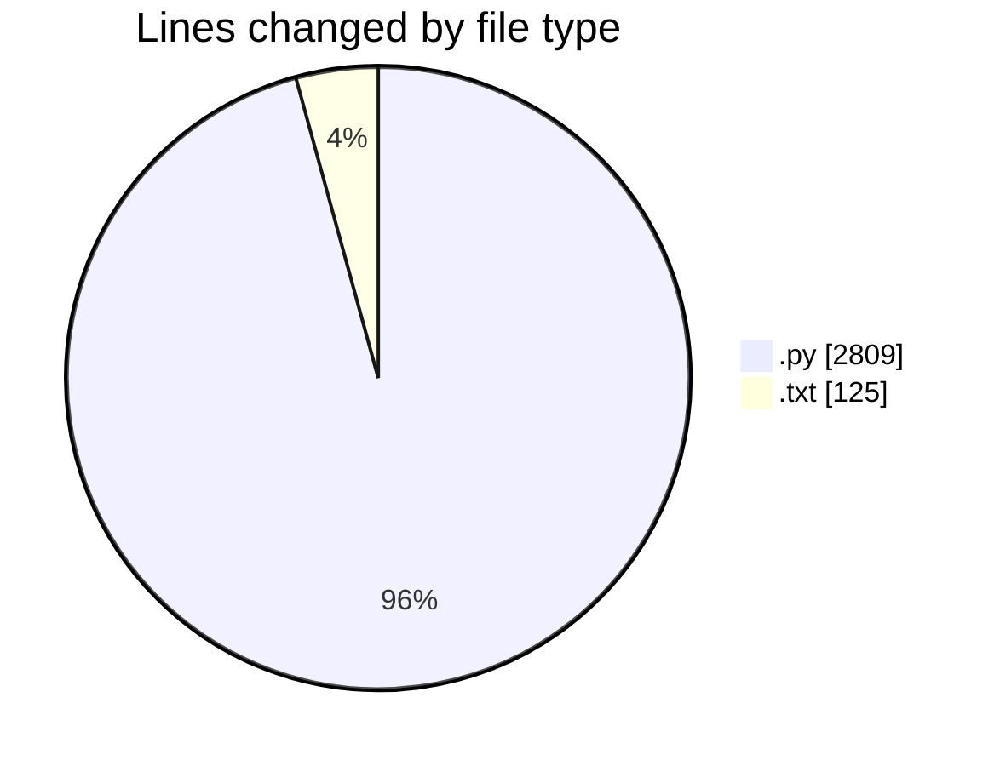
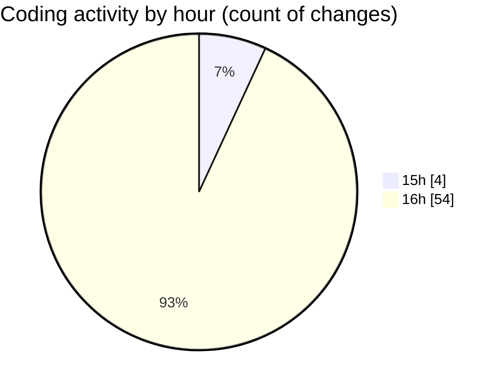

# ZIP FILE - Activity Summary 

## Overall Statistics

| Stat                   | Value                                                             |
| ---------------------- | ----------------------------------------------------------------- |
| **Lines Added** (➕)   | 2729                                          |
| **Lines Removed** (➖) | 205                                        |
| **Net Change** (↕)    | 2524                |
| **Active Time** (⌚)   | 58 minutes |

## Modified Files
- **MODEL.py** (+184, -0)
- **RS-EM.py** (+670, -0)
- **Embedding.py** (+423, -0)
- **Extraction.py** (+471, -0)
- **Embedding_new.py** (+193, -0)
- **Extraction_new.py** (+229, -0)
- **run-command.txt** (+64, -34)
- **Rough.txt** (+27, -0)
- **Embedding_diff.py** (+322, -171)
- **Extraction_diff.py** (+146, -0)

## Visualizations

### By File Type (Lines Changed)

### By Hour (Estimated Activity Count)

> **Last Updated:** 5/26/2025, 4:46:37 PM