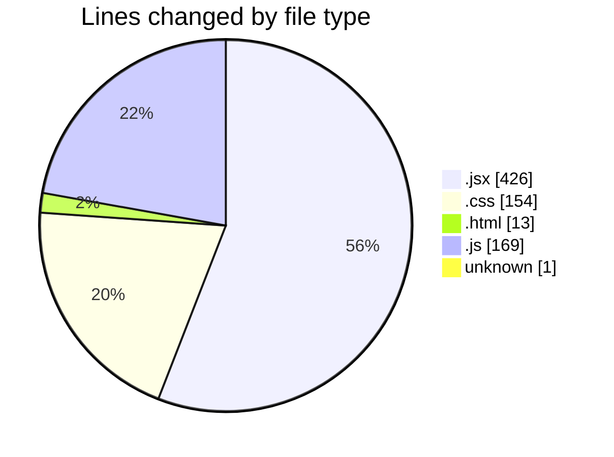
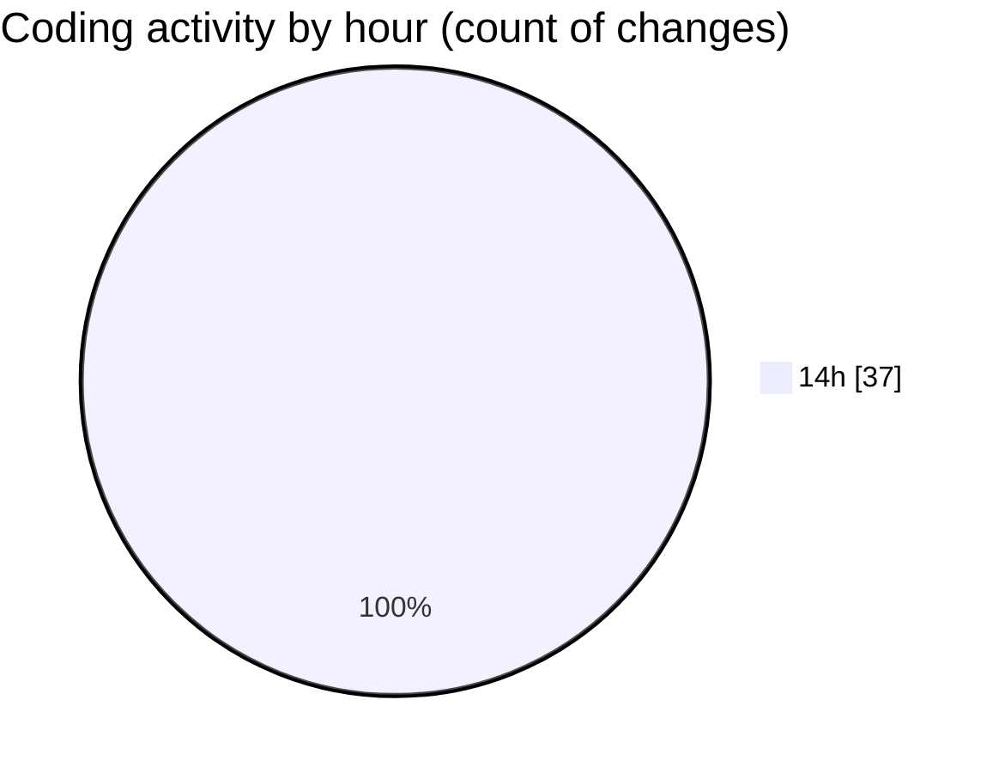

# Projects - Activity Summary 

## Overall Statistics

| Stat                   | Value                                                             |
| ---------------------- | ----------------------------------------------------------------- |
| **Lines Added** (➕)   | 652                                          |
| **Lines Removed** (➖) | 111                                        |
| **Net Change** (↕)    | 541                |
| **Active Time** (⌚)   | 52 minutes |

## Modified Files
- **App.jsx** (+186, -89)
- **LeagueSelector.jsx** (+36, -0)
- **LeagueTable.jsx** (+54, -0)
- **TeamStats.jsx** (+31, -8)
- **CompetitionsList.jsx** (+22, -0)
- **App.css** (+7, -0)
- **index.html** (+13, -0)
- **tailwind.config.js** (+5, -0)
- **server.js** (+77, -4)
- **.env** (+1, -0)
- **server.js** (+73, -10)
- **index.css** (+147, -0)

## Visualizations

### By File Type (Lines Changed)

### By Hour (Estimated Activity Count)

> **Last Updated:** 5/29/2025, 2:44:22 PM