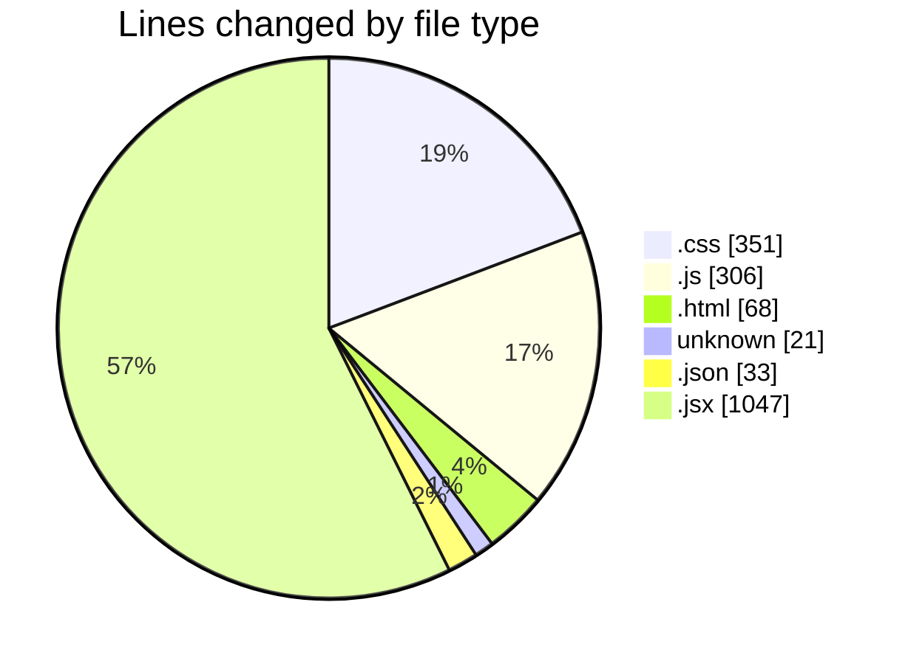
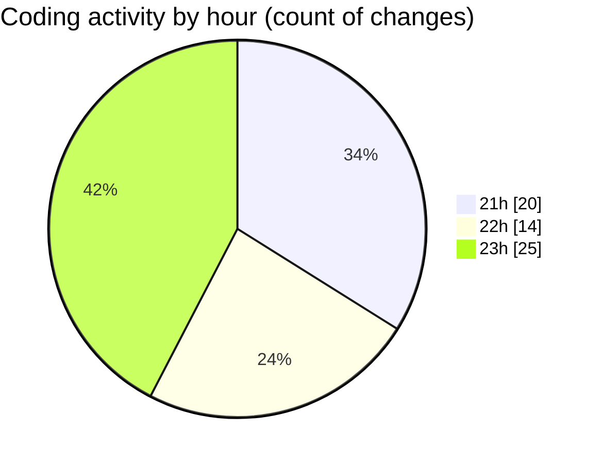

# Projects - Activity Summary 

## Overall Statistics

| Stat                   | Value                                                             |
| ---------------------- | ----------------------------------------------------------------- |
| **Lines Added** (➕)   | 1781                                          |
| **Lines Removed** (➖) | 45                                        |
| **Net Change** (↕)    | 1736                |
| **Active Time** (⌚)   | 67 minutes |

## Modified Files
- **styles.css** (+154, -25)
- **script.js** (+85, -0)
- **index.html** (+35, -0)
- **index.html** (+33, -0)
- **styles.css** (+162, -10)
- **script.js** (+213, -6)
- **COMMIT_EDITMSG** (+17, -4)
- **package.json** (+33, -0)
- **add-entry.jsx** (+472, -0)
- **index.jsx** (+395, -0)
- **[entryId].jsx** (+180, -0)
- **Colors.js** (+1, -0)
- **CommonStyles.js** (+1, -0)

## Visualizations

### By File Type (Lines Changed)

### By Hour (Estimated Activity Count)

> **Last Updated:** 6/1/2025, 11:56:19 PM