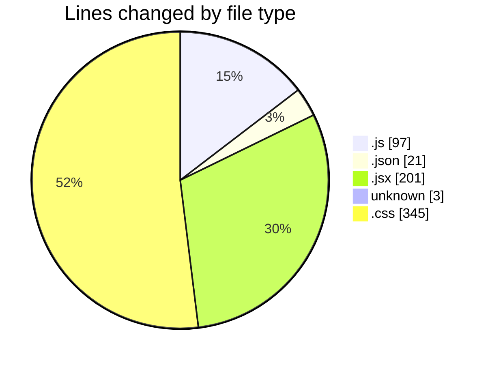
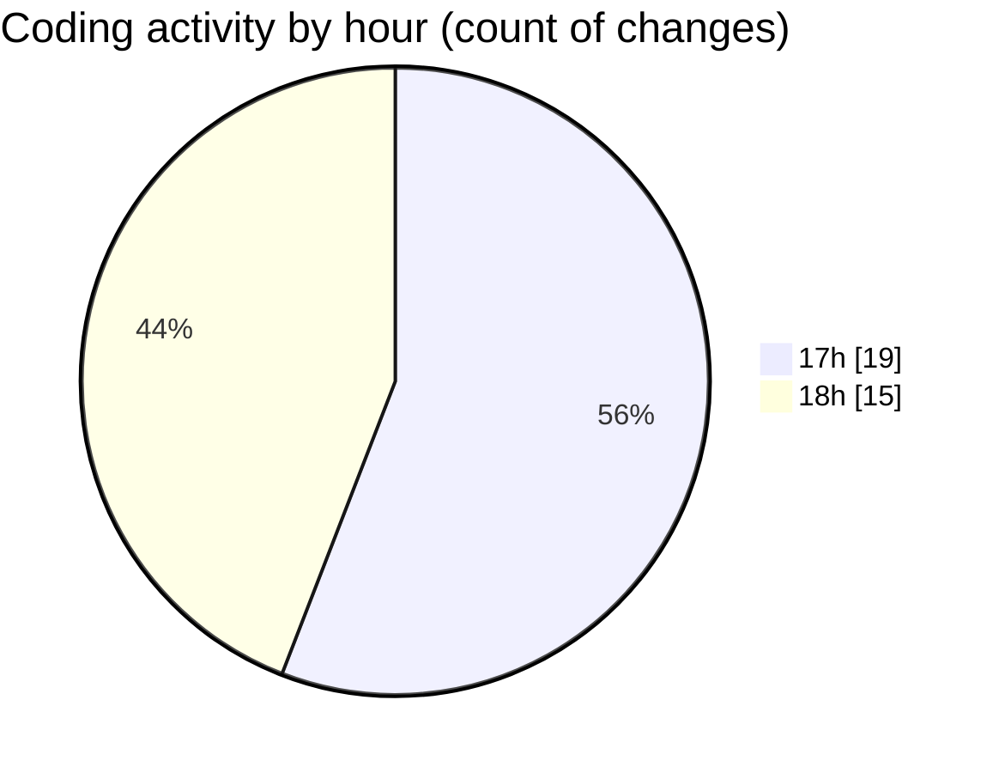

# RealTimeChat - Activity Summary 

## Overall Statistics

| Stat                   | Value                                                             |
| ---------------------- | ----------------------------------------------------------------- |
| **Lines Added** (➕)   | 529                                          |
| **Lines Removed** (➖) | 138                                        |
| **Net Change** (↕)    | 391                |
| **Active Time** (⌚)   | 35 minutes |

## Modified Files
- **index.js** (+79, -5)
- **package.json** (+21, -0)
- **App.jsx** (+134, -67)
- **vite.config.js** (+13, -0)
- **.env** (+3, -0)
- **App.css** (+279, -66)

## Visualizations

### By File Type (Lines Changed)

### By Hour (Estimated Activity Count)

> **Last Updated:** 6/3/2025, 6:46:32 PM