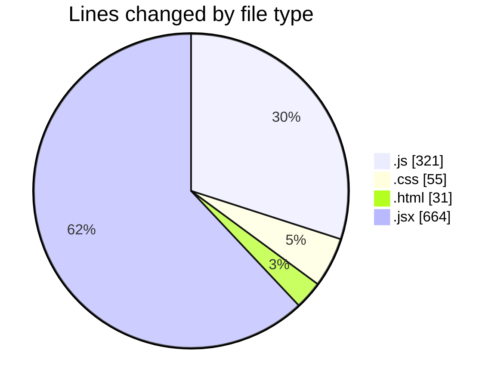
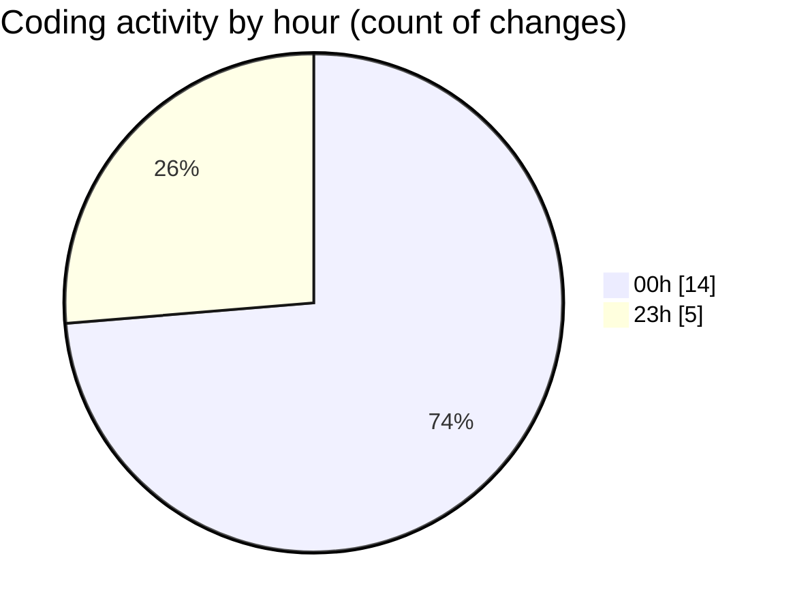

# Projects - Activity Summary 

## Overall Statistics

| Stat                   | Value                                                             |
| ---------------------- | ----------------------------------------------------------------- |
| **Lines Added** (➕)   | 1051                                          |
| **Lines Removed** (➖) | 20                                        |
| **Net Change** (↕)    | 1031                |
| **Active Time** (⌚)   | 24 minutes |

## Modified Files
- **script.js** (+240, -15)
- **style.css** (+55, -0)
- **index.html** (+26, -5)
- **CommonStyles.js** (+54, -0)
- **Colors.js** (+12, -0)
- **index.jsx** (+200, -0)
- **add-entry.jsx** (+249, -0)
- **[entryId].jsx** (+215, -0)

## Visualizations

### By File Type (Lines Changed)

### By Hour (Estimated Activity Count)

> **Last Updated:** 6/14/2025, 12:10:08 AM