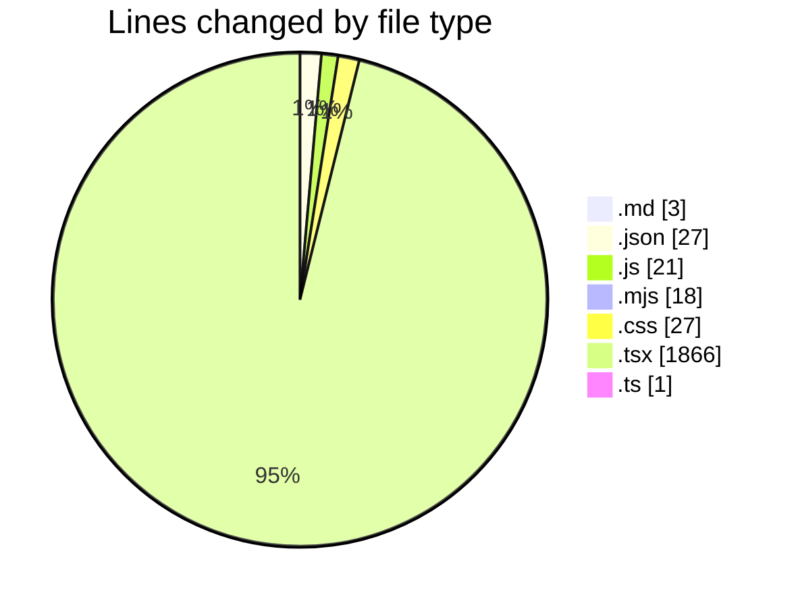
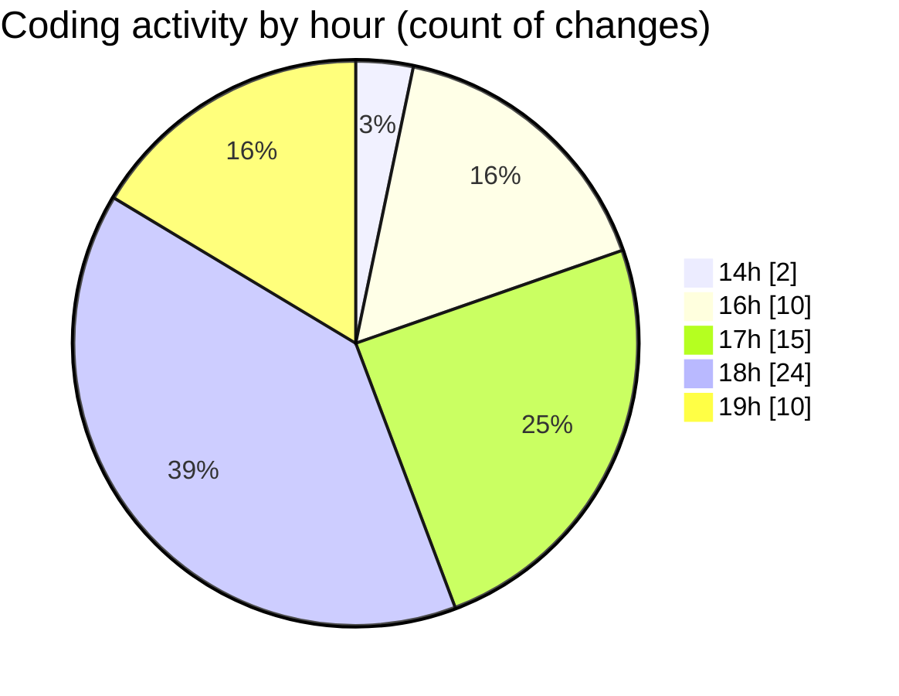

# scopesketch-app - Activity Summary 

## Overall Statistics

| Stat                   | Value                                                             |
| ---------------------- | ----------------------------------------------------------------- |
| **Lines Added** (➕)   | 1333                                          |
| **Lines Removed** (➖) | 630                                        |
| **Net Change** (↕)    | 703                |
| **Active Time** (⌚)   | 105 minutes |

## Modified Files
- **copilot-instructions.md** (+3, -0)
- **tasks.json** (+27, -0)
- **tailwind.config.js** (+15, -0)
- **postcss.config.mjs** (+12, -6)
- **globals.css** (+27, -0)
- **postcss.config.js** (+6, -0)
- **page.tsx** (+1242, -624)
- **html2pdf.d.ts** (+1, -0)

## Visualizations

### By File Type (Lines Changed)

### By Hour (Estimated Activity Count)

> **Last Updated:** 6/18/2025, 7:12:28 PM