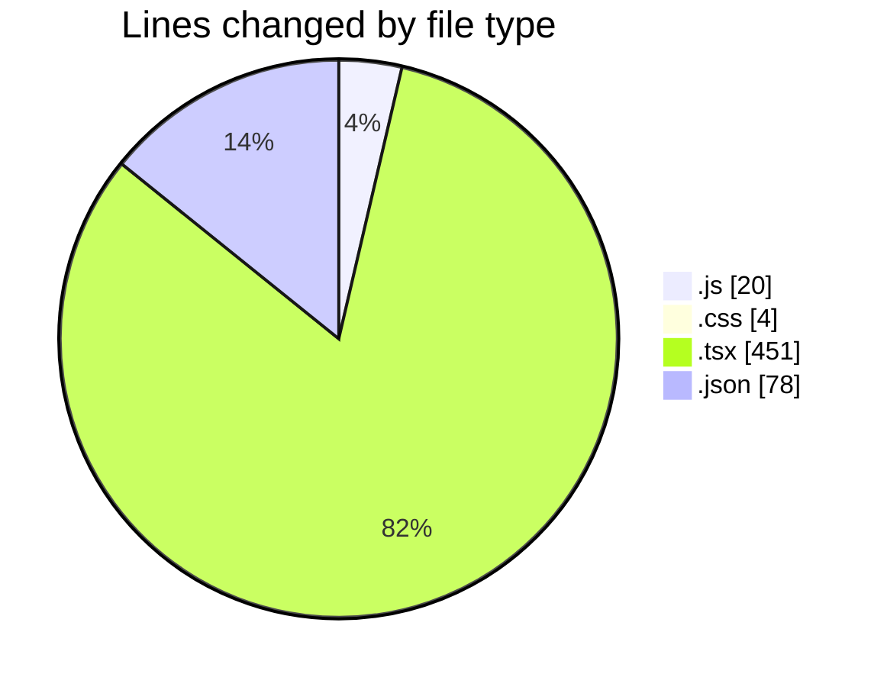
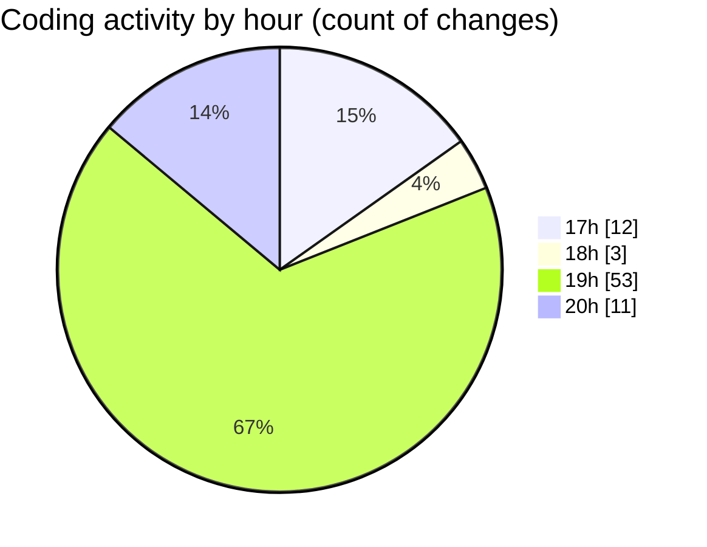

# scopecraft - Activity Summary 

## Overall Statistics

| Stat                   | Value                                                             |
| ---------------------- | ----------------------------------------------------------------- |
| **Lines Added** (➕)   | 514                                          |
| **Lines Removed** (➖) | 39                                        |
| **Net Change** (↕)    | 475                |
| **Active Time** (⌚)   | 100 minutes |

## Modified Files
- **tailwind.config.js** (+13, -0)
- **postcss.config.js** (+7, -0)
- **globals.css** (+4, -0)
- **layout.tsx** (+20, -1)
- **page.tsx** (+46, -13)
- **package.json** (+37, -5)
- **tsconfig.json** (+36, -0)
- **HeroSection.tsx** (+51, -0)
- **HowItWorks.tsx** (+68, -4)
- **KeyFeatures.tsx** (+57, -16)
- **WhoItsFor.tsx** (+52, -0)
- **PricingPlans.tsx** (+75, -0)
- **FinalCTA.tsx** (+25, -0)
- **Footer.tsx** (+23, -0)

## Visualizations

### By File Type (Lines Changed)

### By Hour (Estimated Activity Count)

> **Last Updated:** 6/19/2025, 8:06:17 PM