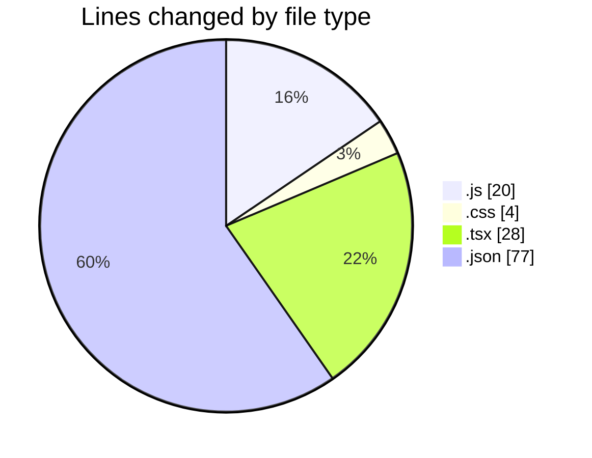
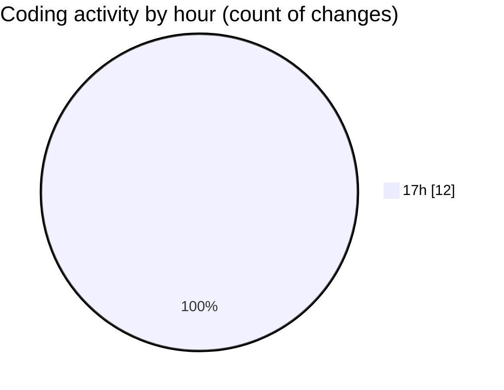

# scopecraft - Activity Summary 

## Overall Statistics

| Stat                   | Value                                                             |
| ---------------------- | ----------------------------------------------------------------- |
| **Lines Added** (➕)   | 124                                          |
| **Lines Removed** (➖) | 5                                        |
| **Net Change** (↕)    | 119                |
| **Active Time** (⌚)   | 11 minutes |

## Modified Files
- **tailwind.config.js** (+13, -0)
- **postcss.config.js** (+7, -0)
- **globals.css** (+4, -0)
- **layout.tsx** (+19, -0)
- **page.tsx** (+9, -0)
- **package.json** (+36, -5)
- **tsconfig.json** (+36, -0)

## Visualizations

### By File Type (Lines Changed)

### By Hour (Estimated Activity Count)

> **Last Updated:** 6/19/2025, 6:01:12 PM