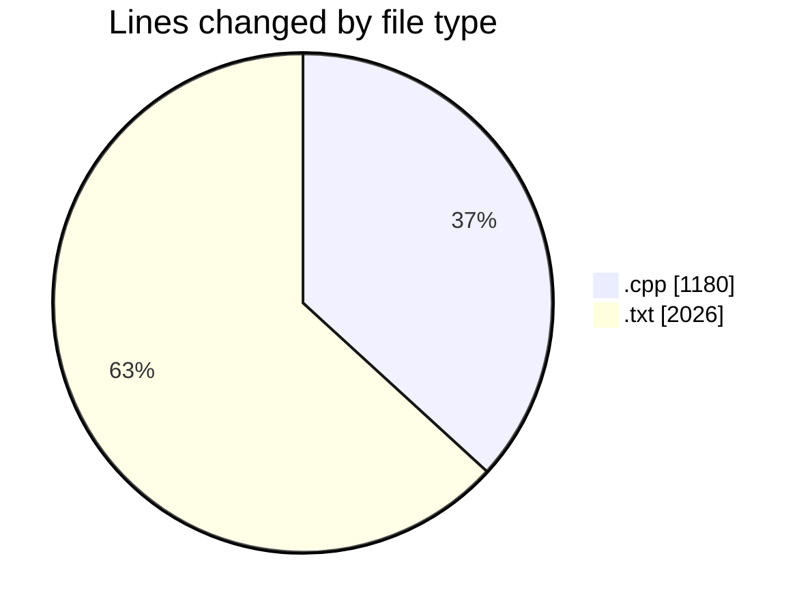
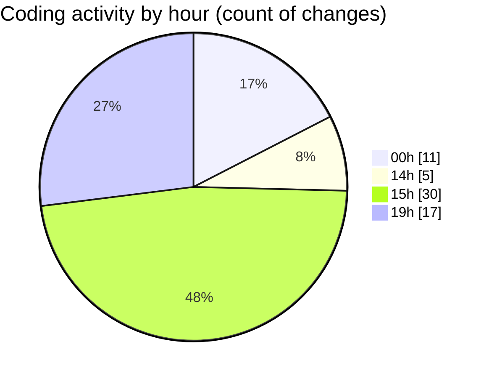

# RefinedProject - Activity Summary 

## Overall Statistics

| Stat                   | Value                                                             |
| ---------------------- | ----------------------------------------------------------------- |
| **Lines Added** (➕)   | 2293                                          |
| **Lines Removed** (➖) | 913                                        |
| **Net Change** (↕)    | 1380                |
| **Active Time** (⌚)   | 67 minutes |

## Modified Files
- **neuralNetwork.cpp** (+141, -0)
- **lavk.cpp** (+166, -0)
- **avk.cpp** (+699, -174)
- **msg.txt** (+184, -142)
- **initialkey.txt** (+1, -0)
- **xor_keys.txt** (+224, -97)
- **csavk_keys.txt** (+502, -375)
- **dataset.txt** (+376, -125)

## Visualizations

### By File Type (Lines Changed)

### By Hour (Estimated Activity Count)

> **Last Updated:** 6/21/2025, 7:17:36 PM