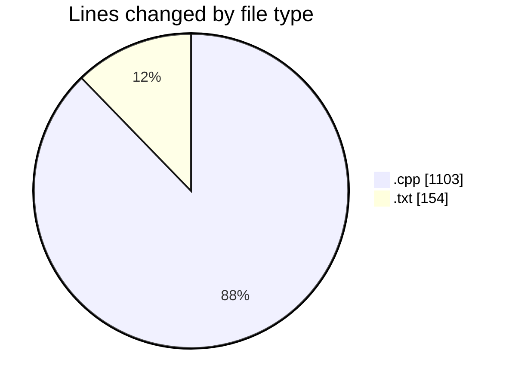
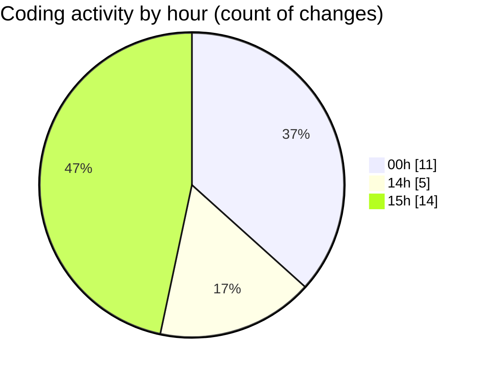

# RefinedProject - Activity Summary 

## Overall Statistics

| Stat                   | Value                                                             |
| ---------------------- | ----------------------------------------------------------------- |
| **Lines Added** (➕)   | 1020                                          |
| **Lines Removed** (➖) | 237                                        |
| **Net Change** (↕)    | 783                |
| **Active Time** (⌚)   | 30 minutes |

## Modified Files
- **neuralNetwork.cpp** (+141, -0)
- **lavk.cpp** (+166, -0)
- **avk.cpp** (+627, -169)
- **msg.txt** (+4, -2)
- **initialkey.txt** (+1, -0)
- **xor_keys.txt** (+81, -66)

## Visualizations

### By File Type (Lines Changed)

### By Hour (Estimated Activity Count)

> **Last Updated:** 6/21/2025, 3:17:52 PM