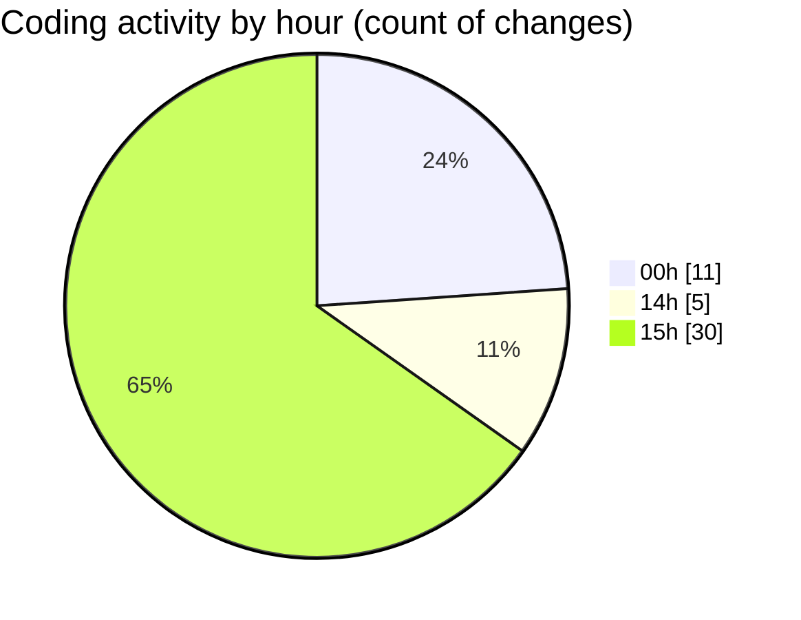

# RefinedProject - Activity Summary 

## Overall Statistics

| Stat                   | Value                                                             |
| ---------------------- | ----------------------------------------------------------------- |
| **Lines Added** (➕)   | 1895                                          |
| **Lines Removed** (➖) | 753                                        |
| **Net Change** (↕)    | 1142                |
| **Active Time** (⌚)   | 51 minutes |

## Modified Files
- **neuralNetwork.cpp** (+141, -0)
- **lavk.cpp** (+166, -0)
- **avk.cpp** (+677, -169)
- **msg.txt** (+184, -142)
- **initialkey.txt** (+1, -0)
- **xor_keys.txt** (+224, -67)
- **csavk_keys.txt** (+502, -375)

## Visualizations

### By File Type (Lines Changed)

### By Hour (Estimated Activity Count)

> **Last Updated:** 6/21/2025, 3:47:35 PM