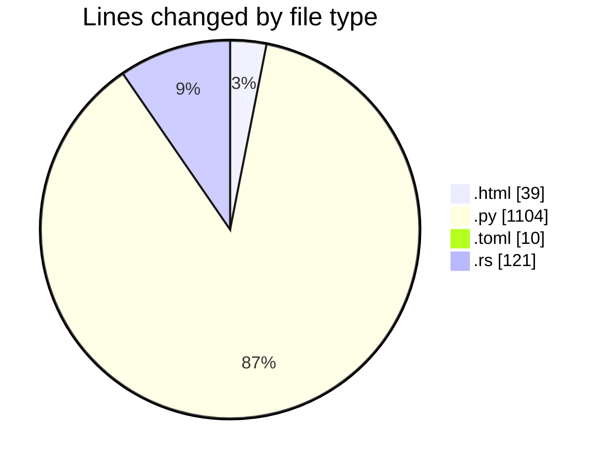
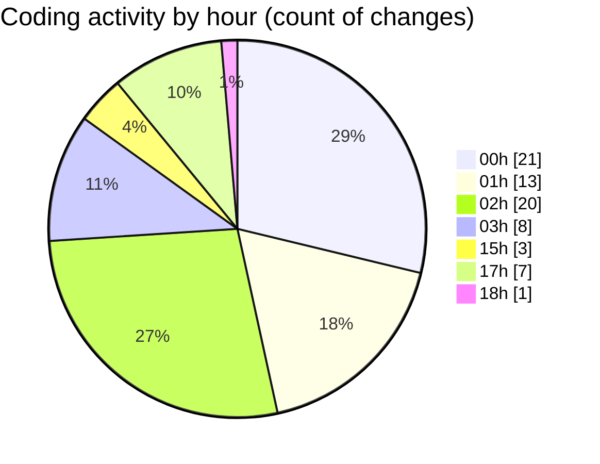

# ...Base - Activity Summary 

## Overall Statistics

| Stat                   | Value                                                             |
| ---------------------- | ----------------------------------------------------------------- |
| **Lines Added** (➕)   | 976                                          |
| **Lines Removed** (➖) | 298                                        |
| **Net Change** (↕)    | 678                |
| **Active Time** (⌚)   | 77 minutes |

## Modified Files
- **index.html** (+37, -2)
- **search.py** (+809, -295)
- **Cargo.toml** (+9, -1)
- **noname.rs** (+50, -0)
- **main.rs** (+21, -0)
- **everything.rs** (+50, -0)

## Visualizations

### By File Type (Lines Changed)

### By Hour (Estimated Activity Count)

> **Last Updated:** 6/22/2025, 6:34:06 PM