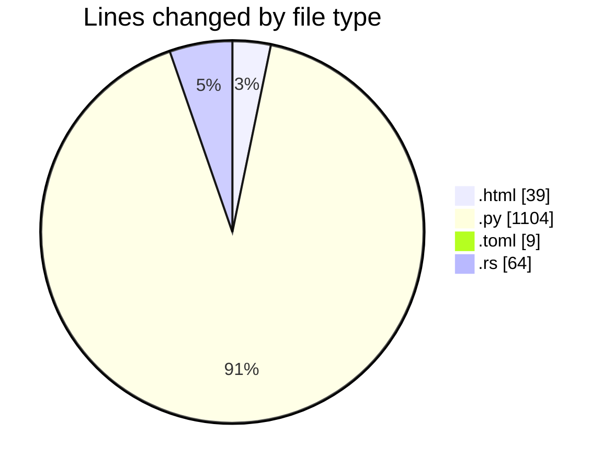
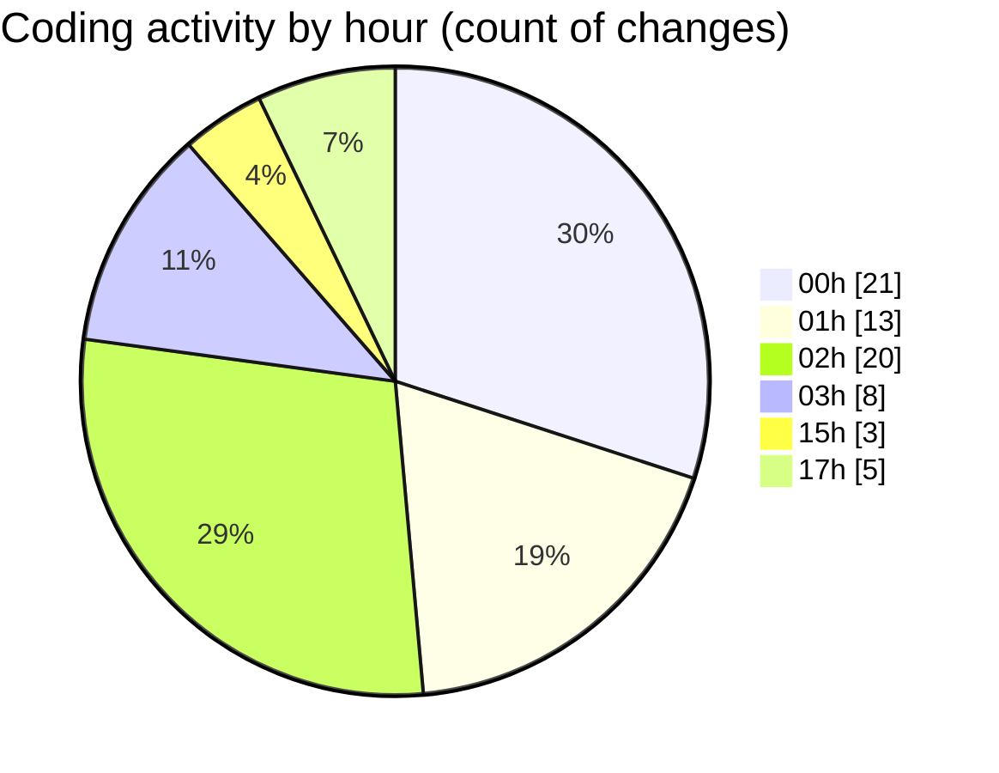

# ...Base - Activity Summary 

## Overall Statistics

| Stat                   | Value                                                             |
| ---------------------- | ----------------------------------------------------------------- |
| **Lines Added** (➕)   | 919                                          |
| **Lines Removed** (➖) | 297                                        |
| **Net Change** (↕)    | 622                |
| **Active Time** (⌚)   | 75 minutes |

## Modified Files
- **index.html** (+37, -2)
- **search.py** (+809, -295)
- **Cargo.toml** (+9, -0)
- **noname.rs** (+50, -0)
- **main.rs** (+14, -0)

## Visualizations

### By File Type (Lines Changed)

### By Hour (Estimated Activity Count)

> **Last Updated:** 6/22/2025, 5:19:06 PM