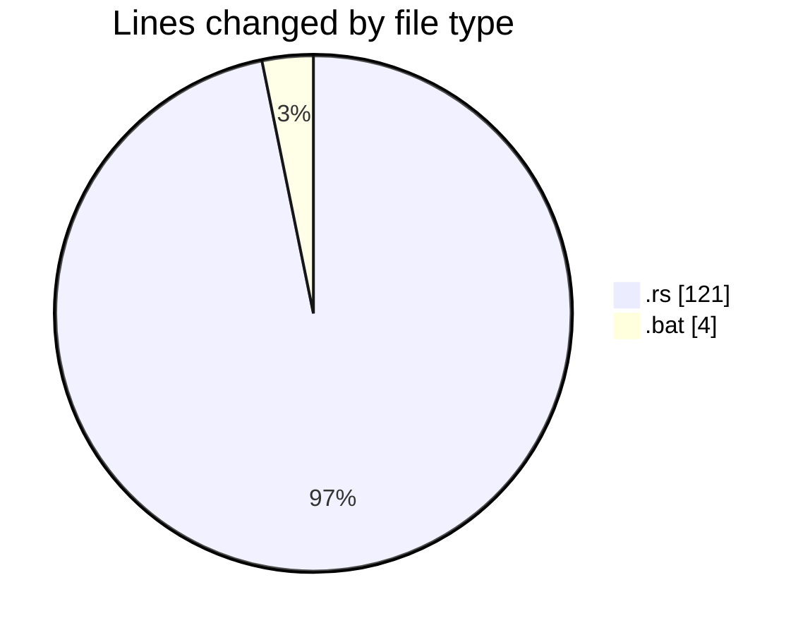
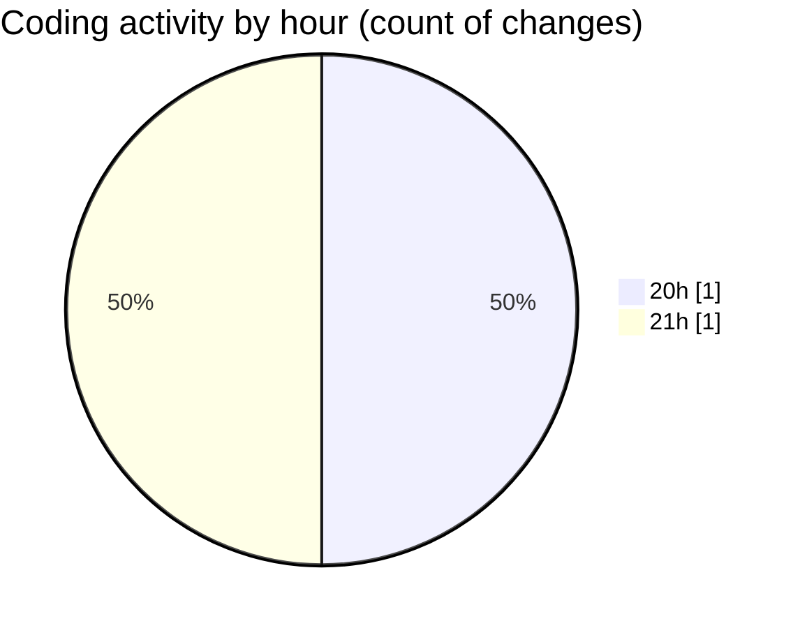

# command-line-file-folder-search-tool - Activity Summary 

## Overall Statistics

| Stat                   | Value                                                             |
| ---------------------- | ----------------------------------------------------------------- |
| **Lines Added** (➕)   | 125                                          |
| **Lines Removed** (➖) | 0                                        |
| **Net Change** (↕)    | 125                |
| **Active Time** (⌚)   | 0 minute |

## Modified Files
- **main.rs** (+121, -0)
- **run-search.bat** (+4, -0)

## Visualizations

### By File Type (Lines Changed)

### By Hour (Estimated Activity Count)

> **Last Updated:** 6/22/2025, 9:11:26 PM