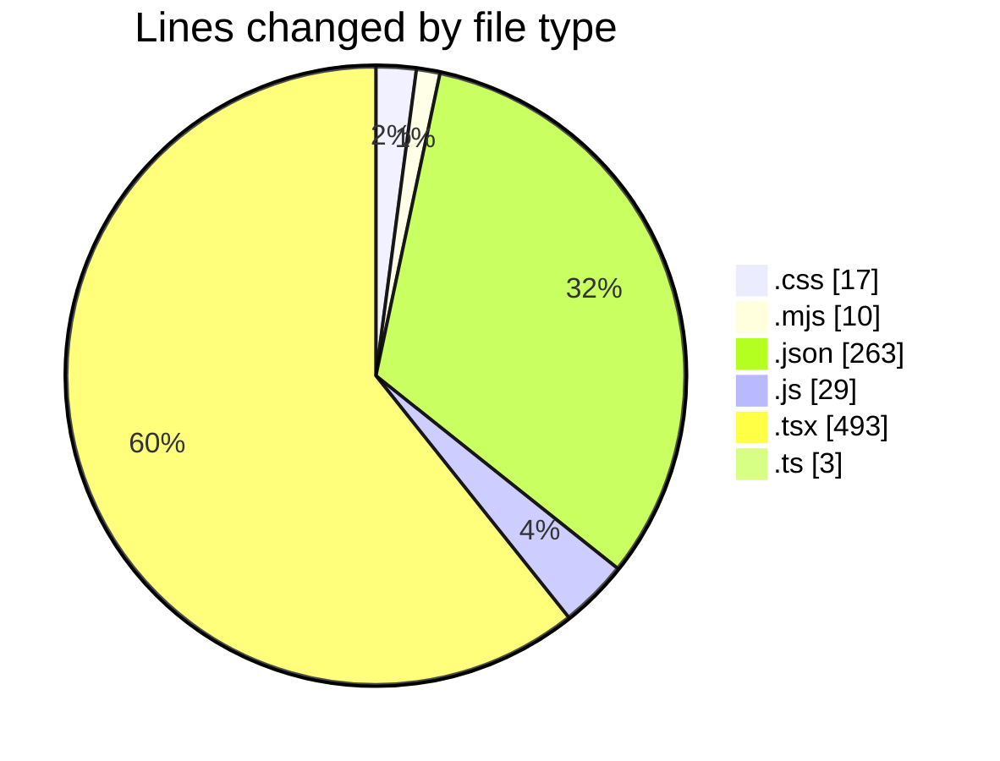
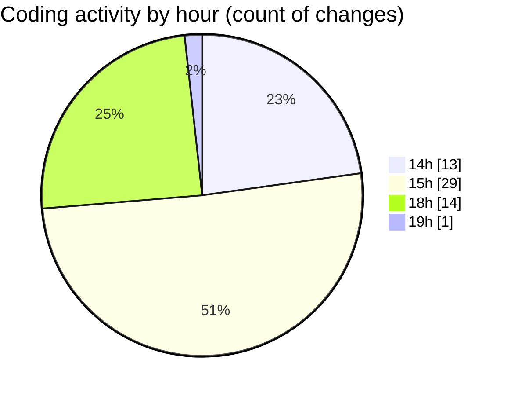

# scopecraft - Activity Summary 

## Overall Statistics

| Stat                   | Value                                                             |
| ---------------------- | ----------------------------------------------------------------- |
| **Lines Added** (➕)   | 741                                          |
| **Lines Removed** (➖) | 74                                        |
| **Net Change** (↕)    | 667                |
| **Active Time** (⌚)   | 56 minutes |

## Modified Files
- **globals.css** (+9, -8)
- **postcss.config.mjs** (+8, -2)
- **tsconfig.json** (+36, -0)
- **tailwind.config.js** (+29, -0)
- **page.tsx** (+31, -4)
- **package.json** (+36, -2)
- **tailwind.config.ts** (+1, -0)
- **settings.json** (+189, -0)
- **NavBar.tsx** (+94, -46)
- **layout.tsx** (+20, -0)
- **PricingPlans.tsx** (+78, -3)
- **page.tsx** (+42, -9)
- **ScopeForm.tsx** (+81, -0)
- **ScopePreview.tsx** (+46, -0)
- **PDFDownloadButton.tsx** (+39, -0)
- **_polyfill.ts** (+2, -0)

## Visualizations

### By File Type (Lines Changed)

### By Hour (Estimated Activity Count)

> **Last Updated:** 6/23/2025, 7:04:59 PM