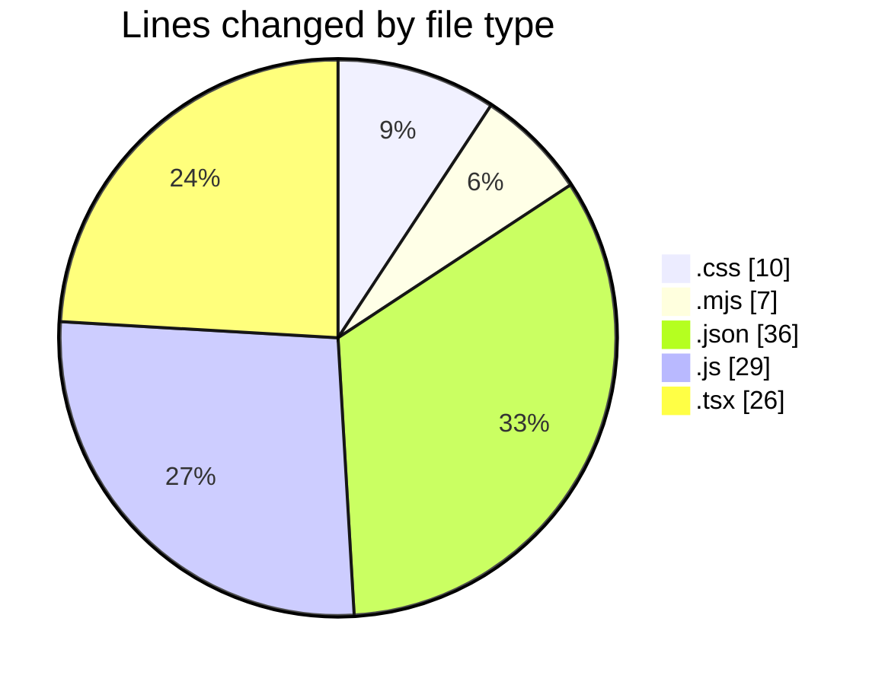

# scopecraft - Activity Summary 

## Overall Statistics

| Stat                   | Value                                                             |
| ---------------------- | ----------------------------------------------------------------- |
| **Lines Added** (➕)   | 107                                          |
| **Lines Removed** (➖) | 1                                        |
| **Net Change** (↕)    | 106                |
| **Active Time** (⌚)   | 5 minutes |

## Modified Files
- **globals.css** (+9, -1)
- **postcss.config.mjs** (+7, -0)
- **tsconfig.json** (+36, -0)
- **tailwind.config.js** (+29, -0)
- **page.tsx** (+26, -0)

## Visualizations

### By File Type (Lines Changed)

### By Hour (Estimated Activity Count)

> **Last Updated:** 6/23/2025, 2:39:57 PM