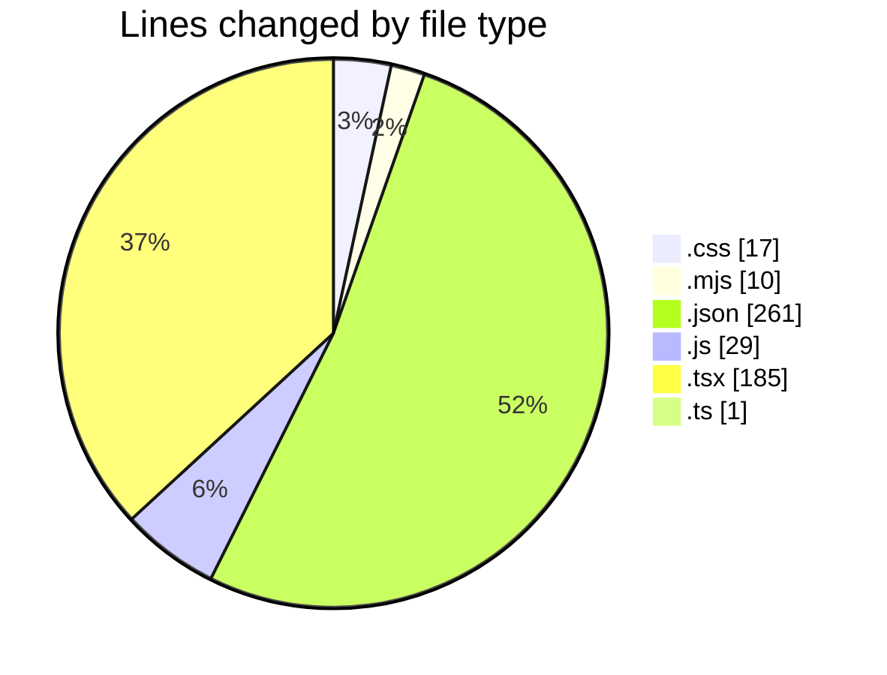
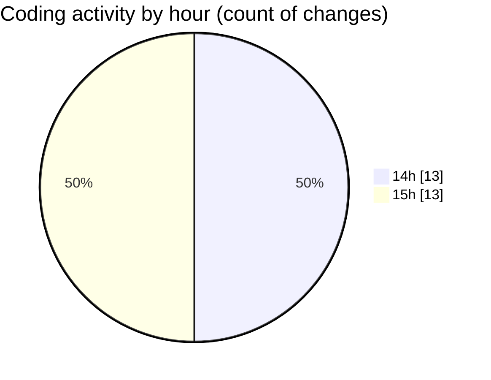

# scopecraft - Activity Summary 

## Overall Statistics

| Stat                   | Value                                                             |
| ---------------------- | ----------------------------------------------------------------- |
| **Lines Added** (➕)   | 447                                          |
| **Lines Removed** (➖) | 56                                        |
| **Net Change** (↕)    | 391                |
| **Active Time** (⌚)   | 26 minutes |

## Modified Files
- **globals.css** (+9, -8)
- **postcss.config.mjs** (+8, -2)
- **tsconfig.json** (+36, -0)
- **tailwind.config.js** (+29, -0)
- **page.tsx** (+27, -0)
- **package.json** (+34, -2)
- **tailwind.config.ts** (+1, -0)
- **settings.json** (+189, -0)
- **NavBar.tsx** (+94, -44)
- **layout.tsx** (+20, -0)

## Visualizations

### By File Type (Lines Changed)

### By Hour (Estimated Activity Count)

> **Last Updated:** 6/23/2025, 3:15:07 PM