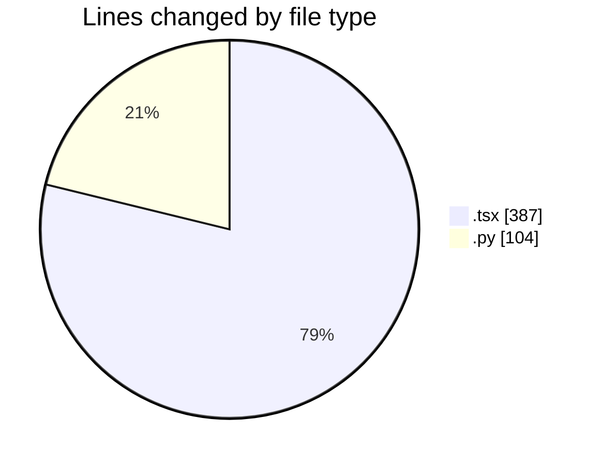
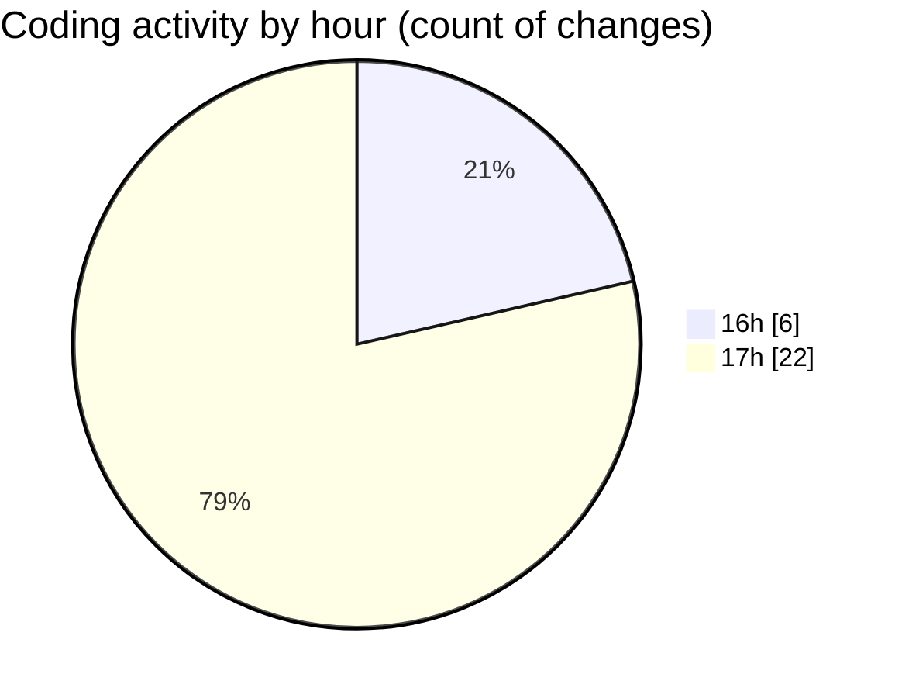

# scopecraft - Activity Summary 

## Overall Statistics

| Stat                   | Value                                                             |
| ---------------------- | ----------------------------------------------------------------- |
| **Lines Added** (➕)   | 448                                          |
| **Lines Removed** (➖) | 43                                        |
| **Net Change** (↕)    | 405                |
| **Active Time** (⌚)   | 30 minutes |

## Modified Files
- **page.tsx** (+116, -39)
- **HeroSection.tsx** (+47, -0)
- **FinalCTA.tsx** (+31, -0)
- **NavBar.tsx** (+55, -1)
- **PricingPlans.tsx** (+95, -3)
- **test.py** (+104, -0)

## Visualizations

### By File Type (Lines Changed)

### By Hour (Estimated Activity Count)

> **Last Updated:** 6/24/2025, 5:57:21 PM