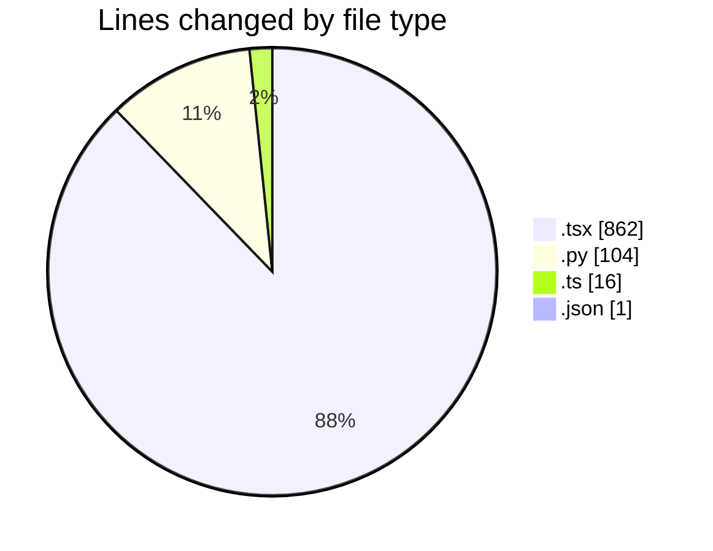
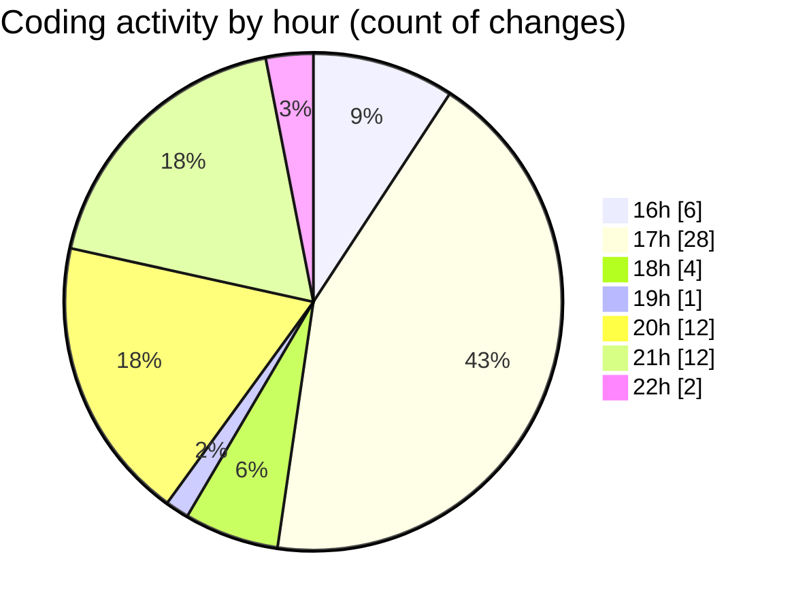

# scopecraft - Activity Summary 

## Overall Statistics

| Stat                   | Value                                                             |
| ---------------------- | ----------------------------------------------------------------- |
| **Lines Added** (➕)   | 920                                          |
| **Lines Removed** (➖) | 63                                        |
| **Net Change** (↕)    | 857                |
| **Active Time** (⌚)   | 89 minutes |

## Modified Files
- **page.tsx** (+135, -52)
- **HeroSection.tsx** (+47, -0)
- **FinalCTA.tsx** (+31, -0)
- **NavBar.tsx** (+55, -1)
- **PricingPlans.tsx** (+95, -3)
- **test.py** (+104, -0)
- **ScopeForm.tsx** (+117, -2)
- **page.tsx** (+73, -0)
- **route.ts** (+16, -0)
- **ScopePreview.tsx** (+60, -5)
- **ScopePDF.tsx** (+186, -0)
- **package.json** (+1, -0)

## Visualizations

### By File Type (Lines Changed)

### By Hour (Estimated Activity Count)

> **Last Updated:** 6/24/2025, 10:57:52 PM