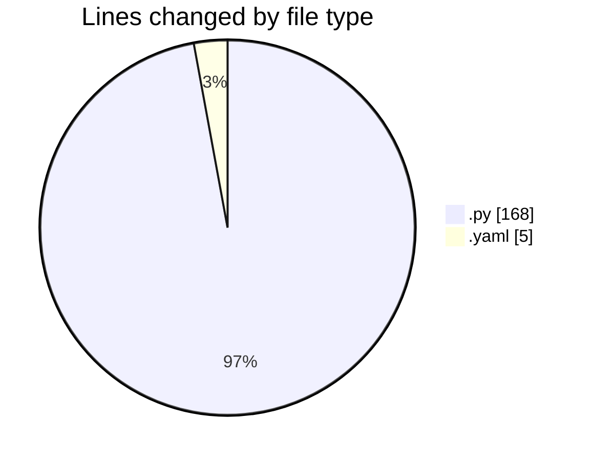

# webapp - Activity Summary 

## Overall Statistics

| Stat                   | Value                                                             |
| ---------------------- | ----------------------------------------------------------------- |
| **Lines Added** (➕)   | 172                                          |
| **Lines Removed** (➖) | 1                                        |
| **Net Change** (↕)    | 171                |
| **Active Time** (⌚)   | 12 minutes |

## Modified Files
- **app.py** (+52, -1)
- **model_loader.py** (+46, -0)
- **preprocessing.py** (+10, -0)
- **configs.yaml** (+5, -0)
- **spacescale.py** (+59, -0)

## Visualizations

### By File Type (Lines Changed)

### By Hour (Estimated Activity Count)

> **Last Updated:** 6/26/2025, 3:20:59 PM