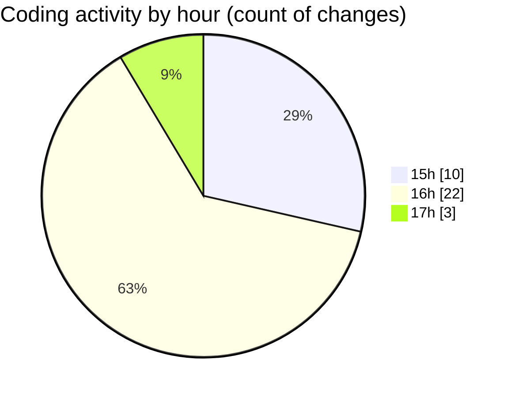

# webapp - Activity Summary 

## Overall Statistics

| Stat                   | Value                                                             |
| ---------------------- | ----------------------------------------------------------------- |
| **Lines Added** (➕)   | 652                                          |
| **Lines Removed** (➖) | 123                                        |
| **Net Change** (↕)    | 529                |
| **Active Time** (⌚)   | 54 minutes |

## Modified Files
- **app.py** (+78, -4)
- **model_loader.py** (+92, -50)
- **preprocessing.py** (+10, -0)
- **configs.yaml** (+5, -0)
- **spacescale.py** (+71, -1)
- **index.html** (+216, -1)
- **segmenter.py** (+129, -66)
- **resumetailoreauto.py** (+51, -1)

## Visualizations

### By File Type (Lines Changed)

### By Hour (Estimated Activity Count)

> **Last Updated:** 6/26/2025, 5:16:00 PM