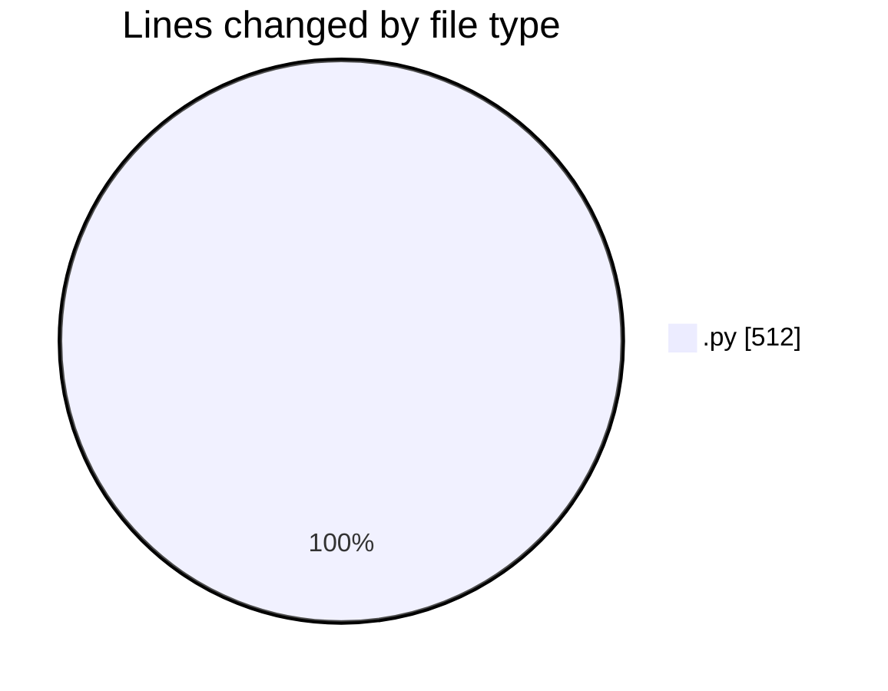
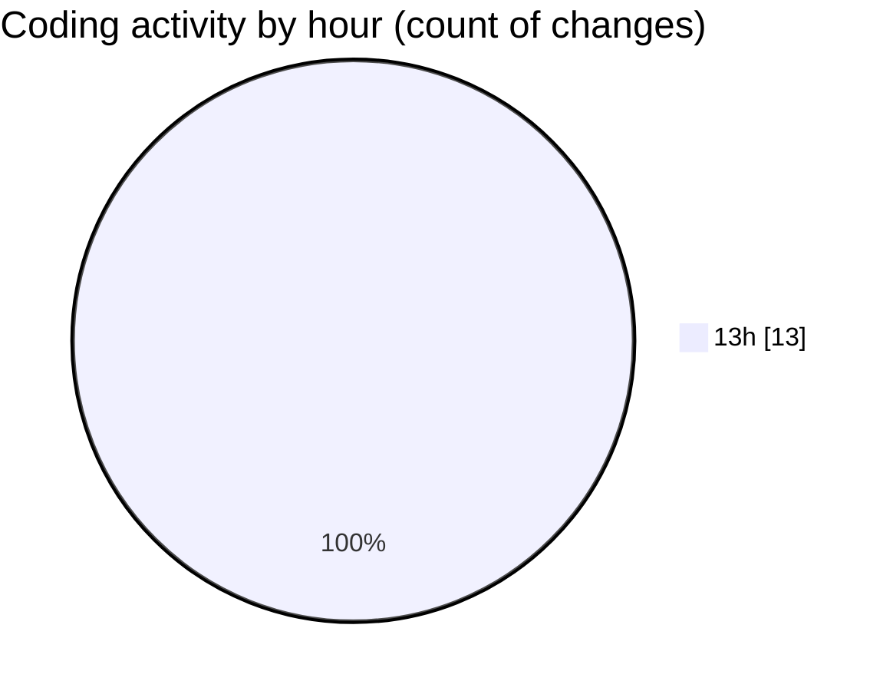

# WhiteBoard - Activity Summary 

## Overall Statistics

| Stat                   | Value                                                             |
| ---------------------- | ----------------------------------------------------------------- |
| **Lines Added** (➕)   | 506                                          |
| **Lines Removed** (➖) | 6                                        |
| **Net Change** (↕)    | 500                |
| **Active Time** (⌚)   | 11 minutes |

## Modified Files
- **hand_tracking.py** (+123, -4)
- **main.py** (+235, -2)
- **main.py** (+91, -0)
- **hand_tracking.py** (+57, -0)

## Visualizations

### By File Type (Lines Changed)

### By Hour (Estimated Activity Count)

> **Last Updated:** 6/29/2025, 1:31:04 PM