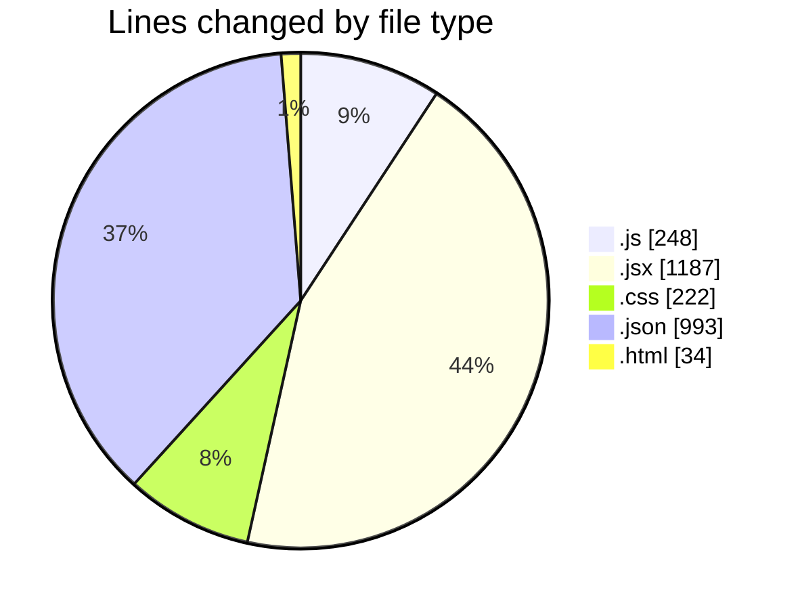
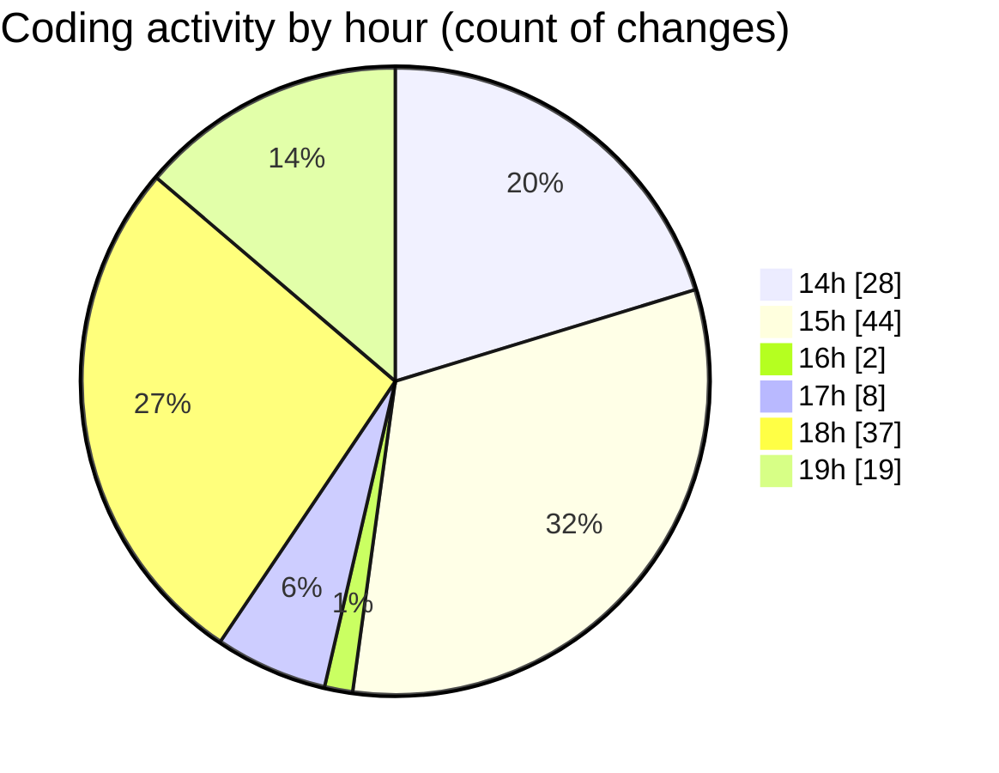

# URLWEBWALATASK - Activity Summary 

## Overall Statistics

| Stat                   | Value                                                             |
| ---------------------- | ----------------------------------------------------------------- |
| **Lines Added** (➕)   | 2342                                          |
| **Lines Removed** (➖) | 342                                        |
| **Net Change** (↕)    | 2000                |
| **Active Time** (⌚)   | 169 minutes |

## Modified Files
- **App.js** (+172, -31)
- **index.js** (+28, -17)
- **Step1.jsx** (+47, -0)
- **Step2.jsx** (+72, -0)
- **Step3.jsx** (+40, -0)
- **index.css** (+69, -68)
- **package-lock.json** (+949, -0)
- **package.json** (+44, -0)
- **App.jsx** (+832, -158)
- **main.jsx** (+22, -16)
- **App.css** (+43, -42)
- **index.html** (+24, -10)

## Visualizations

### By File Type (Lines Changed)

### By Hour (Estimated Activity Count)

> **Last Updated:** 7/1/2025, 7:12:04 PM