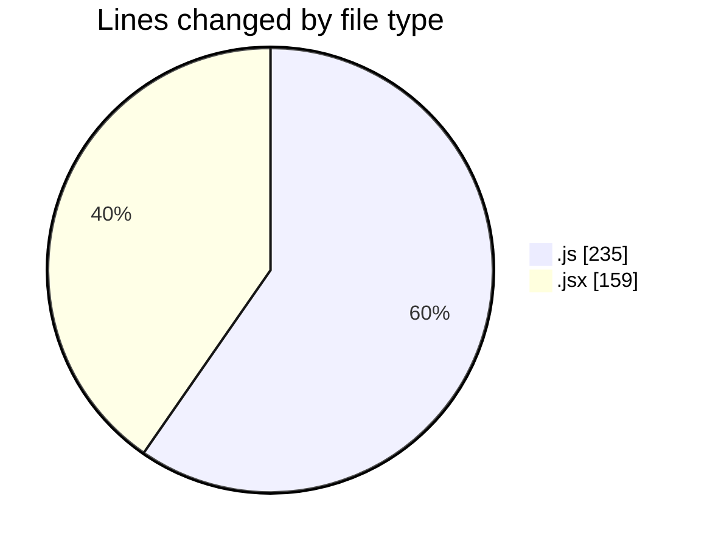
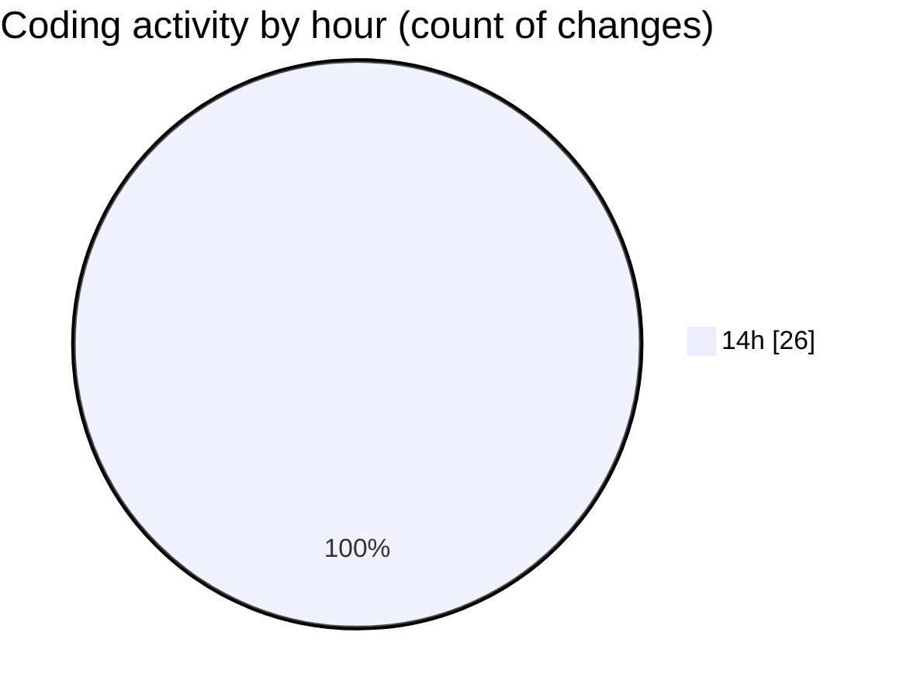

# URLWEBWALATASK - Activity Summary 

## Overall Statistics

| Stat                   | Value                                                             |
| ---------------------- | ----------------------------------------------------------------- |
| **Lines Added** (➕)   | 359                                          |
| **Lines Removed** (➖) | 35                                        |
| **Net Change** (↕)    | 324                |
| **Active Time** (⌚)   | 27 minutes |

## Modified Files
- **App.js** (+172, -18)
- **index.js** (+28, -17)
- **Step1.jsx** (+47, -0)
- **Step2.jsx** (+72, -0)
- **Step3.jsx** (+40, -0)

## Visualizations

### By File Type (Lines Changed)

### By Hour (Estimated Activity Count)

> **Last Updated:** 7/1/2025, 2:38:26 PM