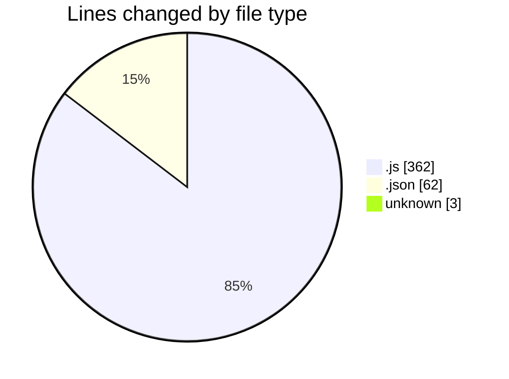
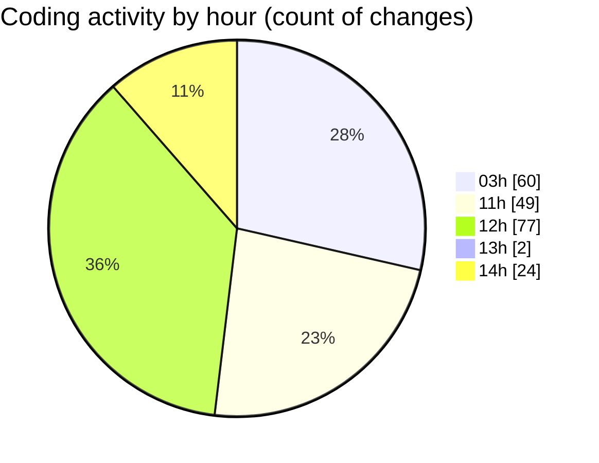

# MERN-ThinkBoard - Activity Summary 

## Overall Statistics

| Stat                   | Value                                                             |
| ---------------------- | ----------------------------------------------------------------- |
| **Lines Added** (➕)   | 343                                          |
| **Lines Removed** (➖) | 84                                        |
| **Net Change** (↕)    | 259                |
| **Active Time** (⌚)   | 263 minutes |

## Modified Files
- **server.js** (+63, -20)
- **package.json** (+53, -9)
- **notesRoutes.js** (+31, -2)
- **notesController.js** (+23, -12)
- **notesController.js** (+79, -17)
- **db.js** (+24, -12)
- **server.js** (+36, -4)
- **.env** (+3, -0)
- **Note.js** (+31, -8)

## Visualizations

### By File Type (Lines Changed)

### By Hour (Estimated Activity Count)

> **Last Updated:** 7/2/2025, 2:27:09 PM