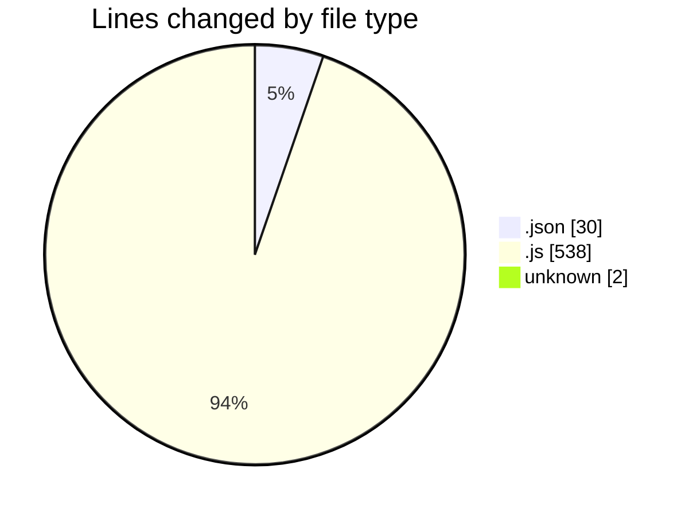
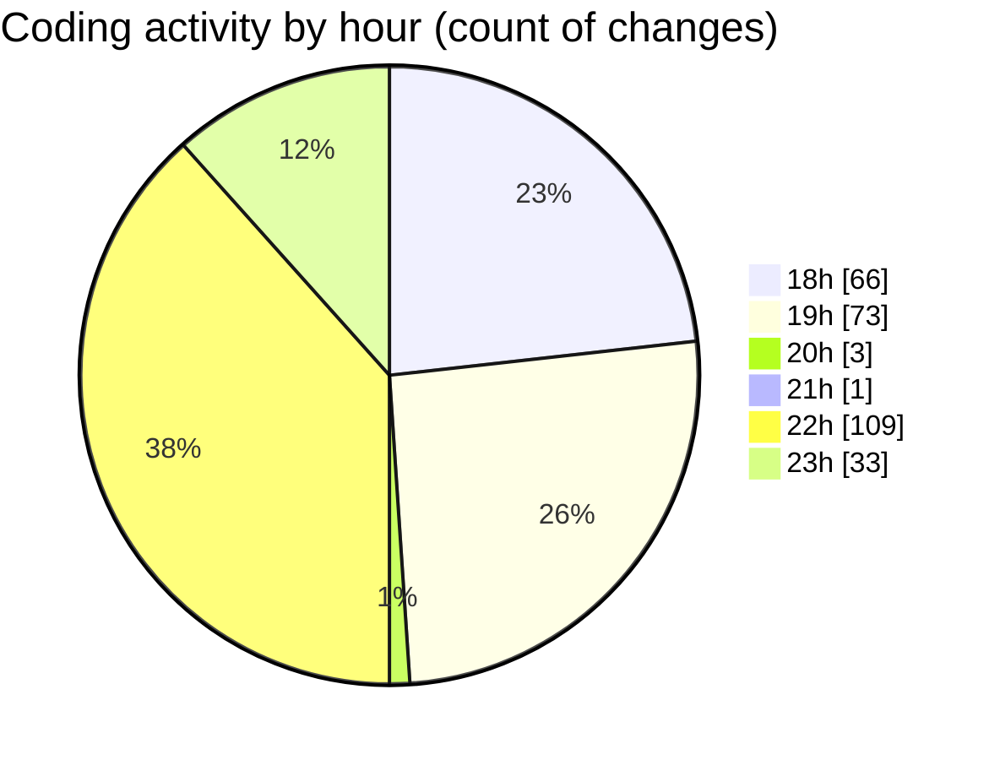

# MERN-WorkoutBoard - Activity Summary 

## Overall Statistics

| Stat                   | Value                                                             |
| ---------------------- | ----------------------------------------------------------------- |
| **Lines Added** (➕)   | 383                                          |
| **Lines Removed** (➖) | 187                                        |
| **Net Change** (↕)    | 196                |
| **Active Time** (⌚)   | 300 minutes |

## Modified Files
- **package.json** (+25, -5)
- **server.js** (+125, -78)
- **.env** (+2, -0)
- **workouts.js** (+96, -51)
- **Workout.js** (+61, -38)
- **workoutModel.js** (+23, -0)
- **workoutController.js** (+51, -15)

## Visualizations

### By File Type (Lines Changed)

### By Hour (Estimated Activity Count)

> **Last Updated:** 7/16/2025, 11:55:29 PM