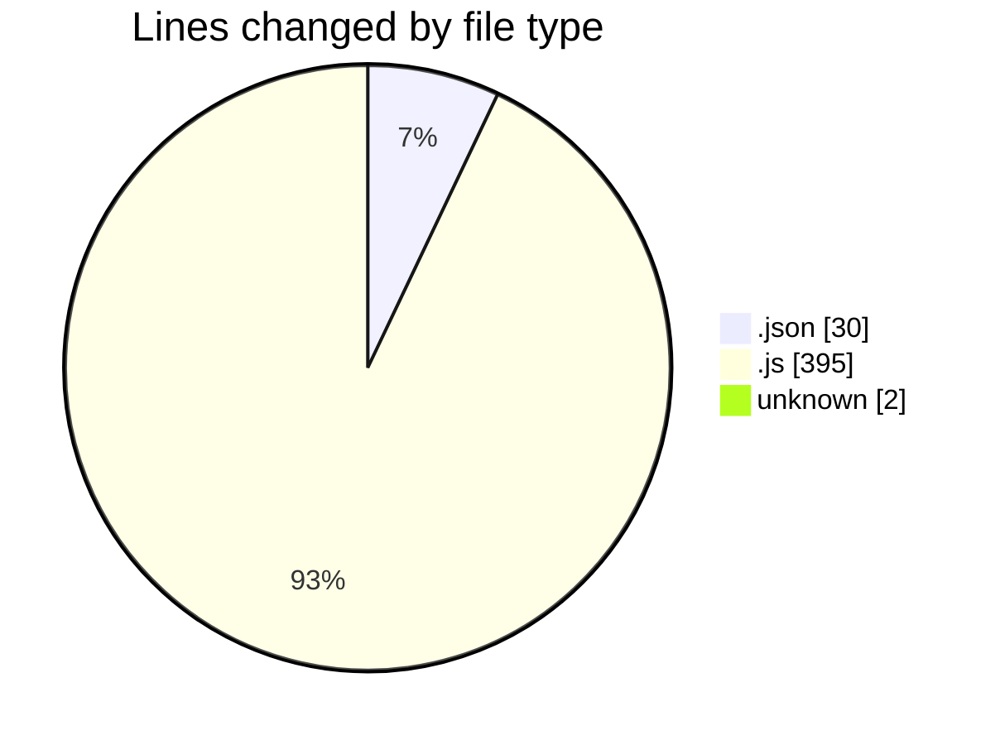
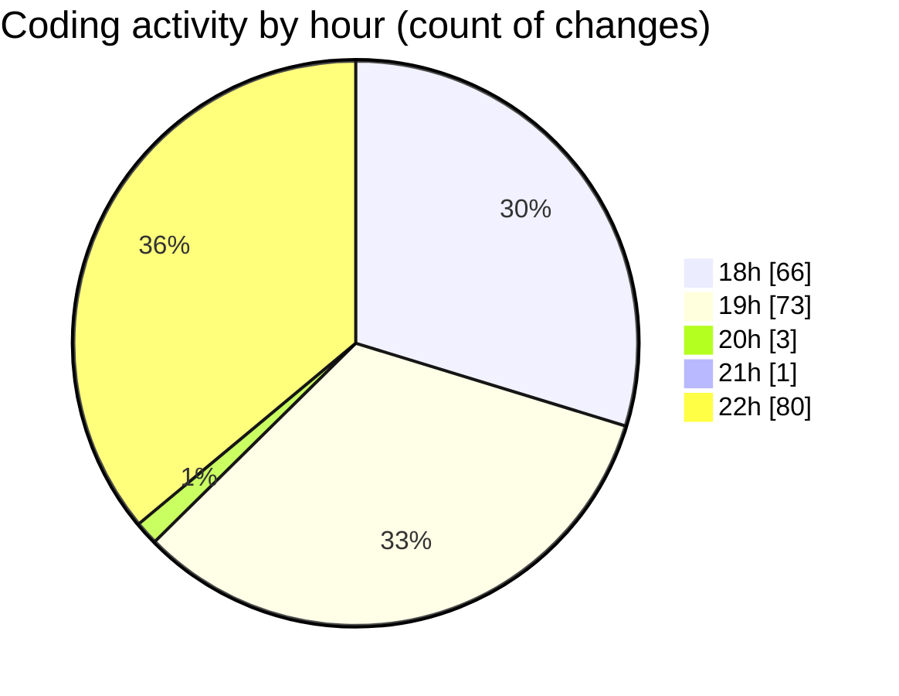

# MERN-WorkoutBoard - Activity Summary 

## Overall Statistics

| Stat                   | Value                                                             |
| ---------------------- | ----------------------------------------------------------------- |
| **Lines Added** (➕)   | 273                                          |
| **Lines Removed** (➖) | 154                                        |
| **Net Change** (↕)    | 119                |
| **Active Time** (⌚)   | 232 minutes |

## Modified Files
- **package.json** (+25, -5)
- **server.js** (+125, -77)
- **.env** (+2, -0)
- **workouts.js** (+85, -49)
- **Workout.js** (+36, -23)

## Visualizations

### By File Type (Lines Changed)

### By Hour (Estimated Activity Count)

> **Last Updated:** 7/16/2025, 10:40:27 PM