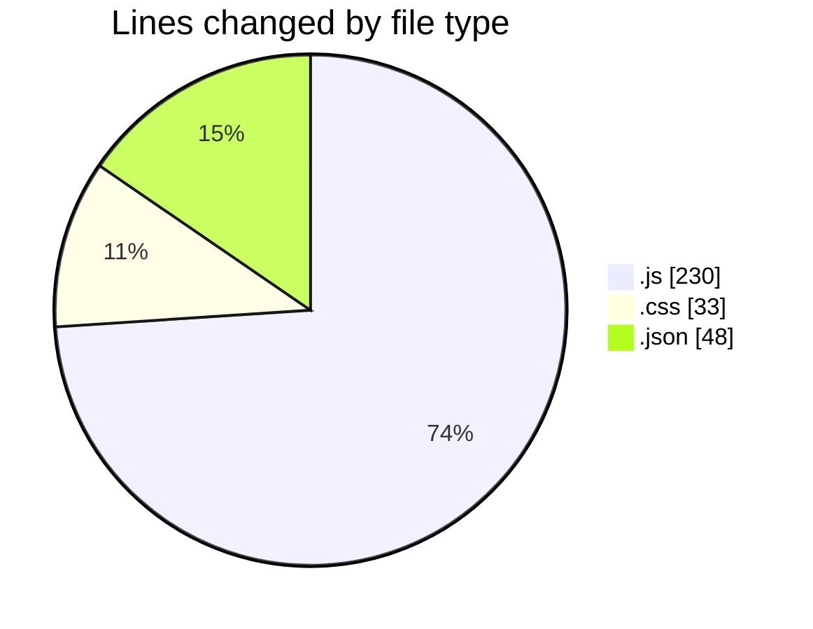
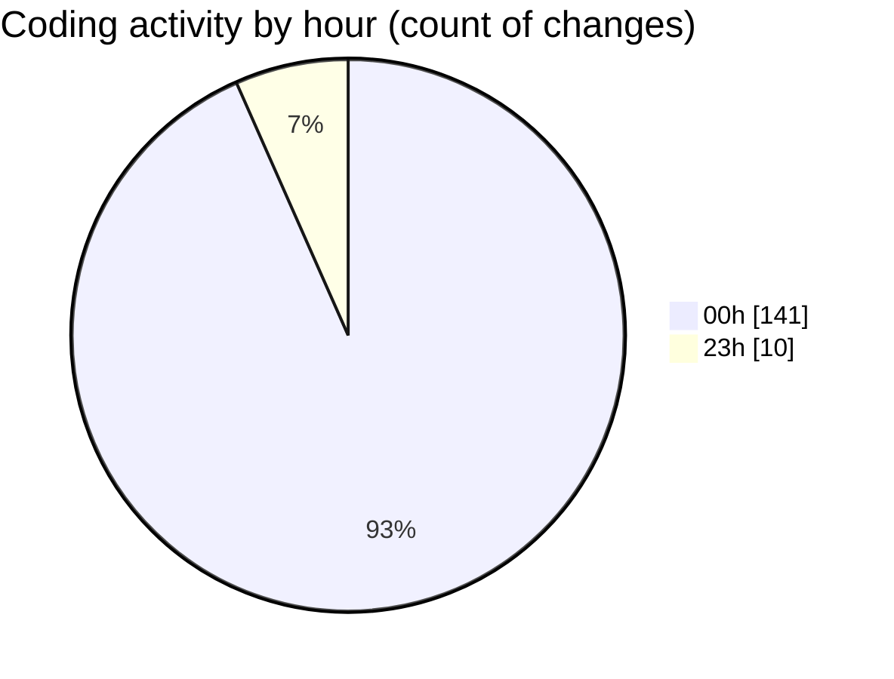

# MERN-WorkoutBoard - Activity Summary 

## Overall Statistics

| Stat                   | Value                                                             |
| ---------------------- | ----------------------------------------------------------------- |
| **Lines Added** (➕)   | 218                                          |
| **Lines Removed** (➖) | 93                                        |
| **Net Change** (↕)    | 125                |
| **Active Time** (⌚)   | 190 minutes |

## Modified Files
- **App.js** (+11, -9)
- **Navbar.js** (+91, -77)
- **Home.js** (+24, -4)
- **index.css** (+33, -0)
- **package.json** (+45, -3)
- **WorkoutDetails.js** (+14, -0)

## Visualizations

### By File Type (Lines Changed)

### By Hour (Estimated Activity Count)

> **Last Updated:** 7/18/2025, 12:53:37 AM