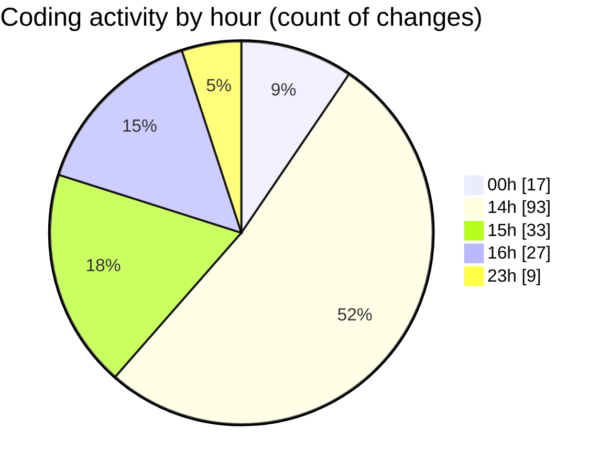

# MERN-WorkoutBoard - Activity Summary 

## Overall Statistics

| Stat                   | Value                                                             |
| ---------------------- | ----------------------------------------------------------------- |
| **Lines Added** (➕)   | 493                                          |
| **Lines Removed** (➖) | 196                                        |
| **Net Change** (↕)    | 297                |
| **Active Time** (⌚)   | 182 minutes |

## Modified Files
- **workoutContext.js** (+153, -104)
- **index.js** (+19, -2)
- **useWorkoutsContext.js** (+43, -33)
- **Home.js** (+70, -34)
- **WorkoutForm.js** (+69, -0)
- **WorkoutDetails.js** (+43, -17)
- **workoutController.js** (+96, -6)

## Visualizations

### By File Type (Lines Changed)

### By Hour (Estimated Activity Count)

> **Last Updated:** 7/20/2025, 4:19:08 PM