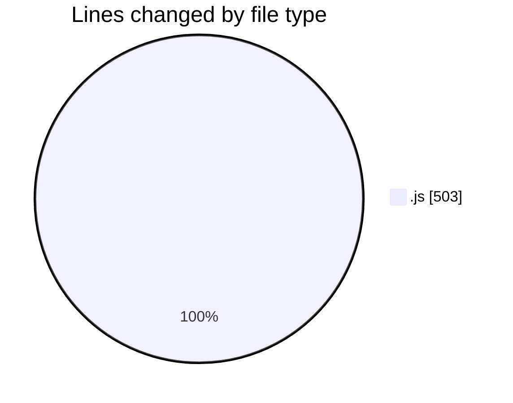
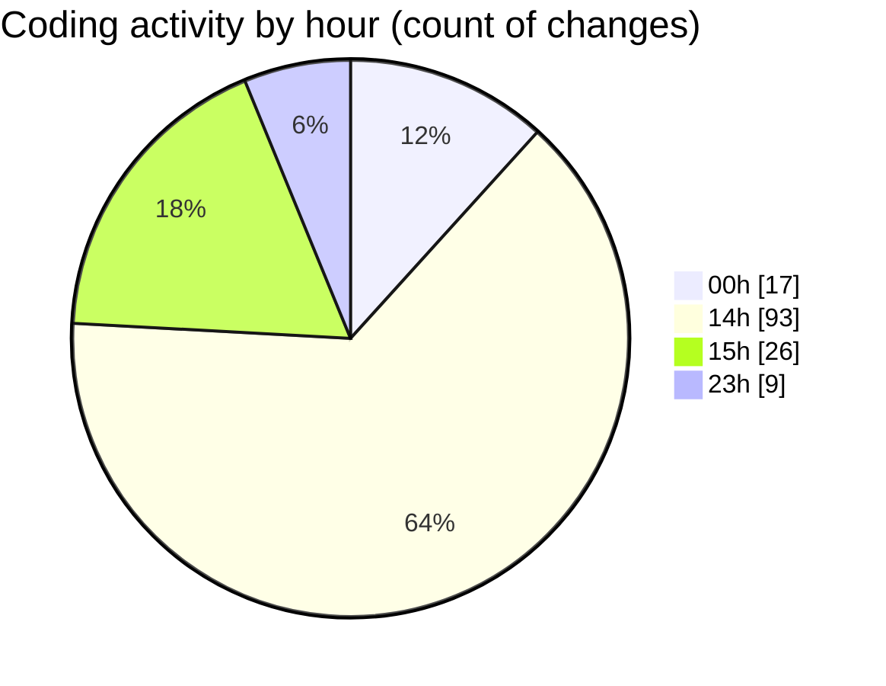

# MERN-WorkoutBoard - Activity Summary 

## Overall Statistics

| Stat                   | Value                                                             |
| ---------------------- | ----------------------------------------------------------------- |
| **Lines Added** (➕)   | 353                                          |
| **Lines Removed** (➖) | 150                                        |
| **Net Change** (↕)    | 203                |
| **Active Time** (⌚)   | 150 minutes |

## Modified Files
- **workoutContext.js** (+110, -64)
- **index.js** (+19, -2)
- **useWorkoutsContext.js** (+43, -33)
- **Home.js** (+70, -34)
- **WorkoutForm.js** (+68, -0)
- **WorkoutDetails.js** (+43, -17)

## Visualizations

### By File Type (Lines Changed)

### By Hour (Estimated Activity Count)

> **Last Updated:** 7/20/2025, 3:14:06 PM