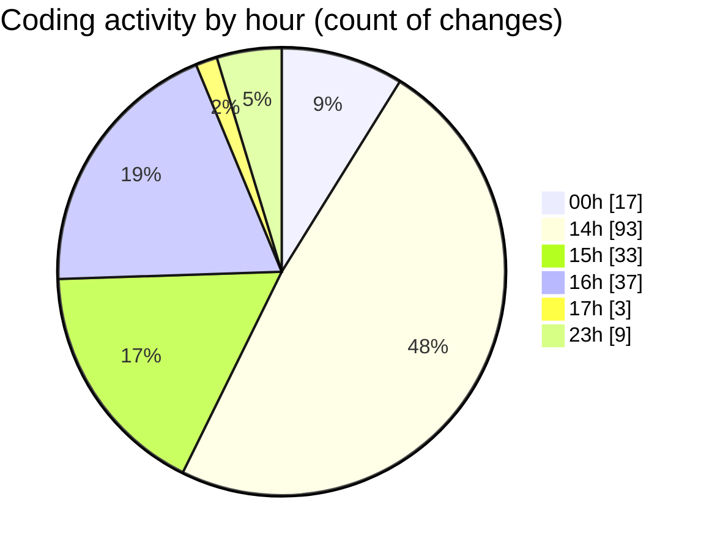

# MERN-WorkoutBoard - Activity Summary 

## Overall Statistics

| Stat                   | Value                                                             |
| ---------------------- | ----------------------------------------------------------------- |
| **Lines Added** (➕)   | 653                                          |
| **Lines Removed** (➖) | 201                                        |
| **Net Change** (↕)    | 452                |
| **Active Time** (⌚)   | 201 minutes |

## Modified Files
- **workoutContext.js** (+153, -104)
- **index.js** (+19, -2)
- **useWorkoutsContext.js** (+43, -33)
- **Home.js** (+70, -34)
- **WorkoutForm.js** (+78, -4)
- **WorkoutDetails.js** (+46, -17)
- **workoutController.js** (+96, -6)
- **index.css** (+103, -1)
- **index.html** (+45, -0)

## Visualizations

### By File Type (Lines Changed)

### By Hour (Estimated Activity Count)

> **Last Updated:** 7/20/2025, 5:19:06 PM