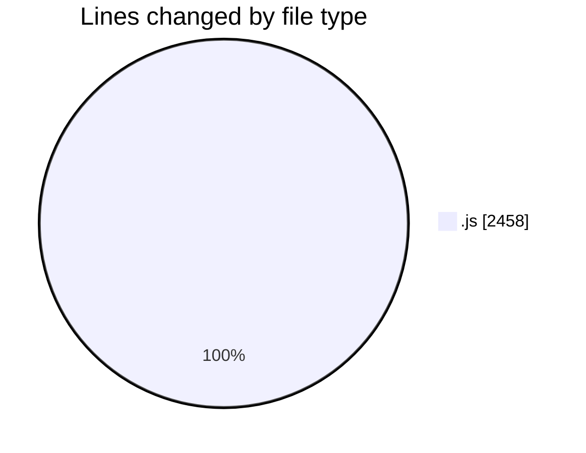
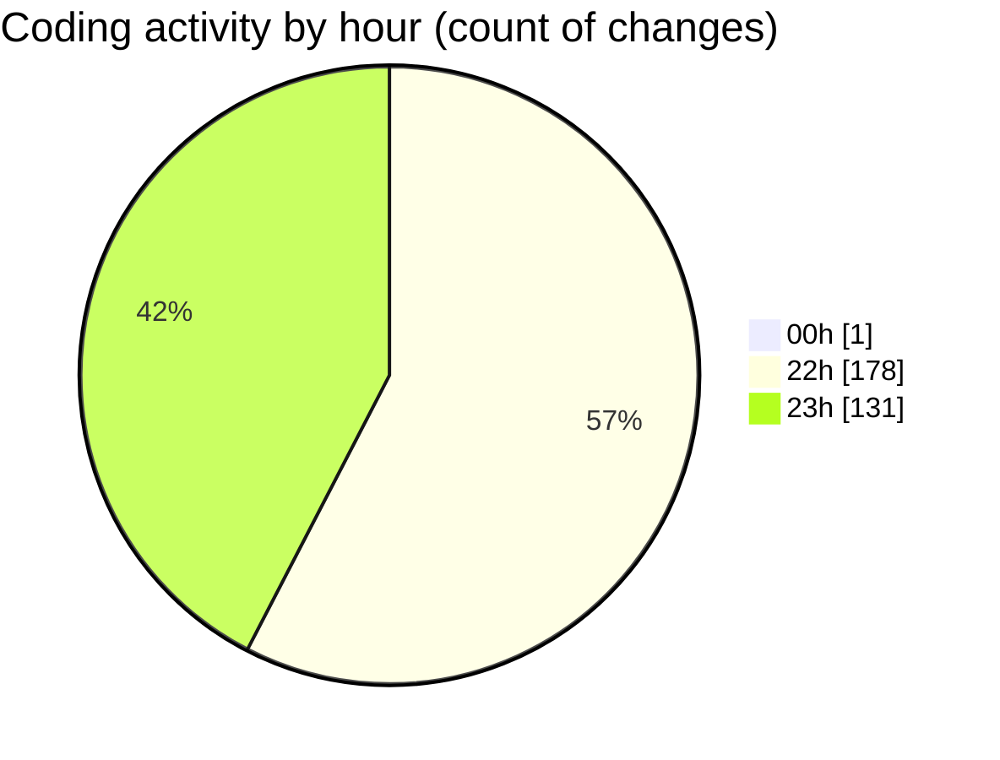

# Javascript - Activity Summary 

## Overall Statistics

| Stat                   | Value                                                             |
| ---------------------- | ----------------------------------------------------------------- |
| **Lines Added** (➕)   | 1322                                          |
| **Lines Removed** (➖) | 1136                                        |
| **Net Change** (↕)    | 186                |
| **Active Time** (⌚)   | 334 minutes |

## Modified Files
- **one.js** (+826, -737)
- **switch.js** (+65, -35)
- **truthyAndfalsy.js** (+10, -3)
- **truthyAndfalsy.js** (+412, -360)
- **forLoop.js** (+9, -1)

## Visualizations

### By File Type (Lines Changed)

### By Hour (Estimated Activity Count)

> **Last Updated:** 8/4/2025, 11:41:41 PM