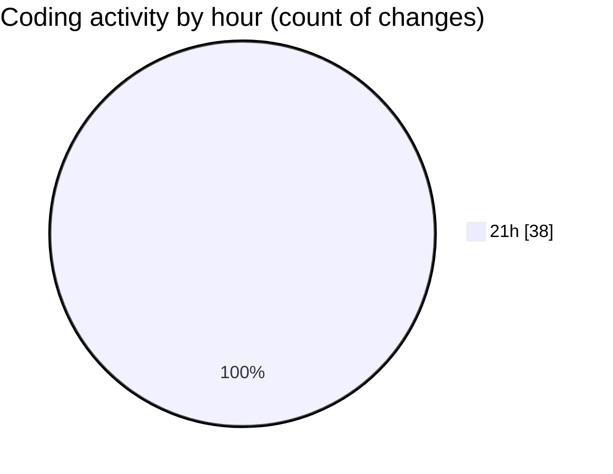

# scopecraft - Activity Summary 

## Overall Statistics

| Stat                   | Value                                                             |
| ---------------------- | ----------------------------------------------------------------- |
| **Lines Added** (➕)   | 530                                          |
| **Lines Removed** (➖) | 21                                        |
| **Net Change** (↕)    | 509                |
| **Active Time** (⌚)   | 47 minutes |

## Modified Files
- **HeroSection.tsx** (+46, -0)
- **PricingPlans.tsx** (+92, -0)
- **MasterLayout.jsx** (+4, -1)
- **ScopeForm.tsx** (+114, -0)
- **page.tsx** (+25, -4)
- **page.tsx** (+73, -8)
- **page.tsx** (+83, -6)
- **layout.tsx** (+26, -2)
- **Header.tsx** (+67, -0)

## Visualizations

### By File Type (Lines Changed)

### By Hour (Estimated Activity Count)

> **Last Updated:** 10/13/2025, 9:55:15 PM