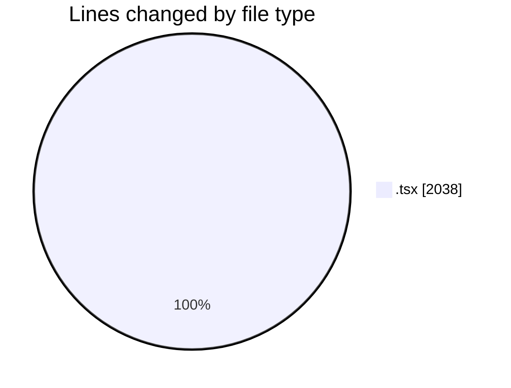
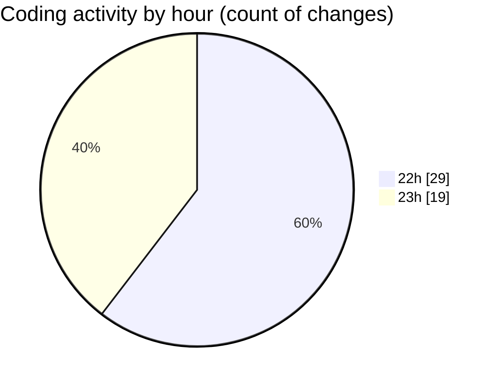

# scopecraft - Activity Summary 

## Overall Statistics

| Stat                   | Value                                                             |
| ---------------------- | ----------------------------------------------------------------- |
| **Lines Added** (➕)   | 1421                                          |
| **Lines Removed** (➖) | 617                                        |
| **Net Change** (↕)    | 804                |
| **Active Time** (⌚)   | 59 minutes |

## Modified Files
- **HeroSection.tsx** (+125, -39)
- **HowItWorks.tsx** (+68, -0)
- **KeyFeatures.tsx** (+41, -0)
- **FinalCTA.tsx** (+32, -1)
- **ScopePreview.tsx** (+494, -438)
- **ScopeForm.tsx** (+447, -139)
- **ScopePDF.tsx** (+186, -0)
- **PDFDownloadButton.tsx** (+28, -0)

## Visualizations

### By File Type (Lines Changed)

### By Hour (Estimated Activity Count)

> **Last Updated:** 10/19/2025, 11:47:05 PM