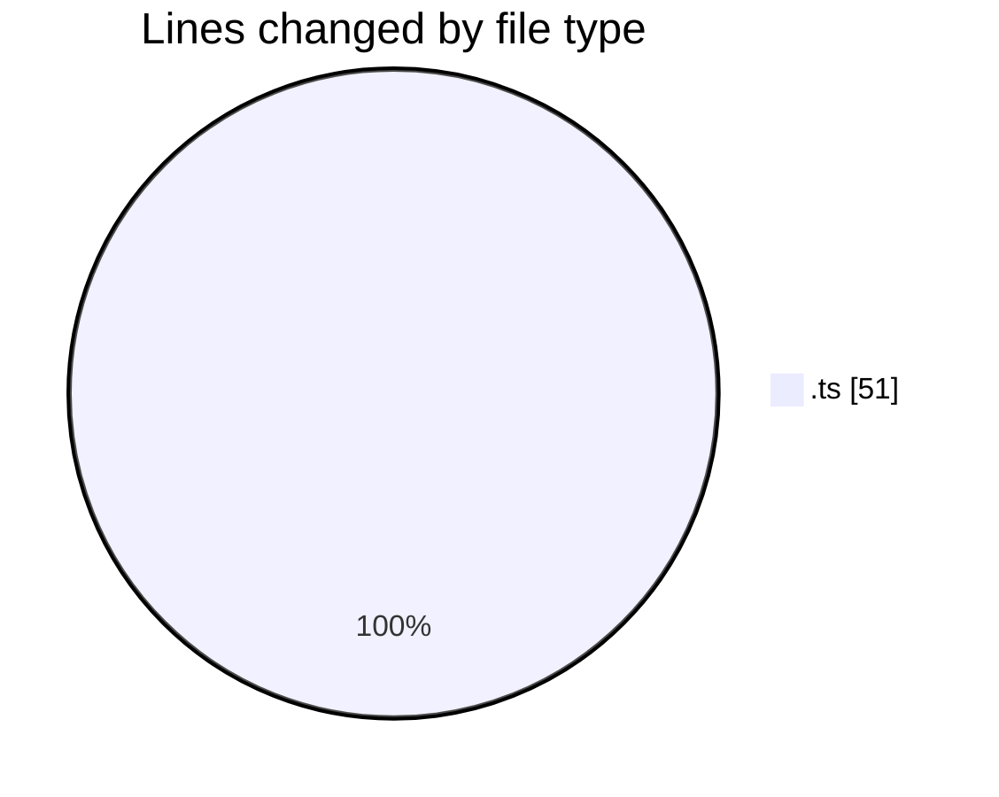
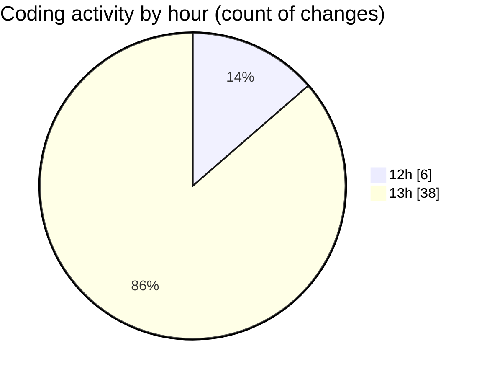

# Typescript - Activity Summary 

## Overall Statistics

| Stat                   | Value                                                             |
| ---------------------- | ----------------------------------------------------------------- |
| **Lines Added** (➕)   | 32                                          |
| **Lines Removed** (➖) | 19                                        |
| **Net Change** (↕)    | 13                |
| **Active Time** (⌚)   | 45 minutes |

## Modified Files
- **intro.ts** (+8, -3)
- **variable.ts** (+24, -16)

## Visualizations

### By File Type (Lines Changed)

### By Hour (Estimated Activity Count)

> **Last Updated:** 10/19/2025, 1:35:17 PM