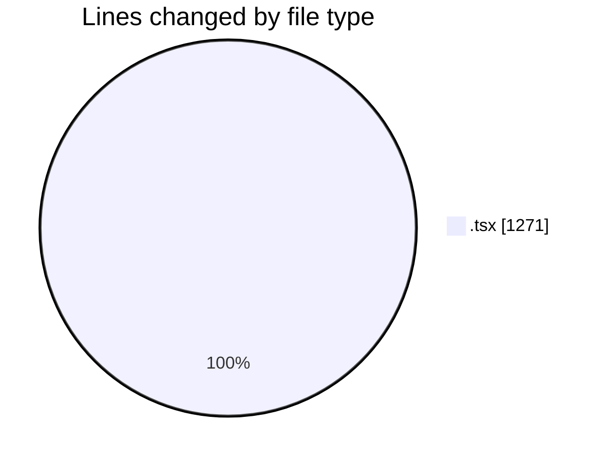
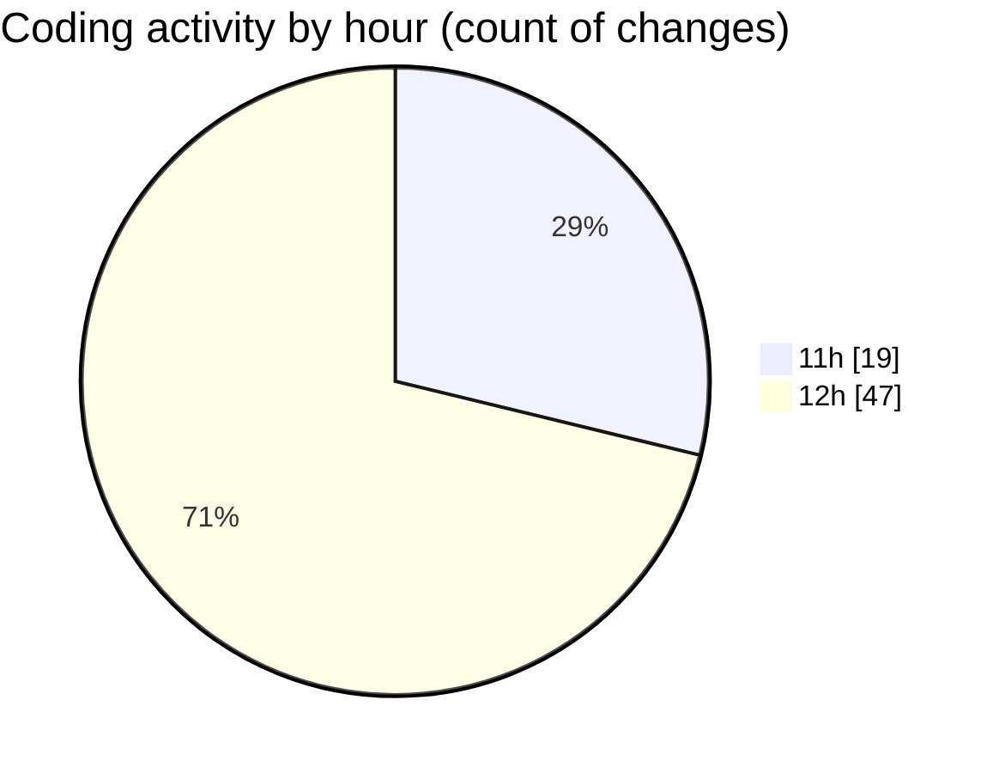

# scopecraft - Activity Summary 

## Overall Statistics

| Stat                   | Value                                                             |
| ---------------------- | ----------------------------------------------------------------- |
| **Lines Added** (➕)   | 976                                          |
| **Lines Removed** (➖) | 295                                        |
| **Net Change** (↕)    | 681                |
| **Active Time** (⌚)   | 89 minutes |

## Modified Files
- **HeroSection.tsx** (+83, -49)
- **HowItWorks.tsx** (+72, -2)
- **KeyFeatures.tsx** (+44, -5)
- **WhoItsFor.tsx** (+55, -4)
- **PricingPlans.tsx** (+98, -1)
- **FinalCTA.tsx** (+40, -1)
- **page.tsx** (+294, -204)
- **PDFDownloadButton.tsx** (+22, -1)
- **ScopePDF.tsx** (+53, -2)
- **ScopeForm.tsx** (+116, -0)
- **Scope.tsx** (+99, -26)

## Visualizations

### By File Type (Lines Changed)

### By Hour (Estimated Activity Count)

> **Last Updated:** 10/20/2025, 12:50:55 PM