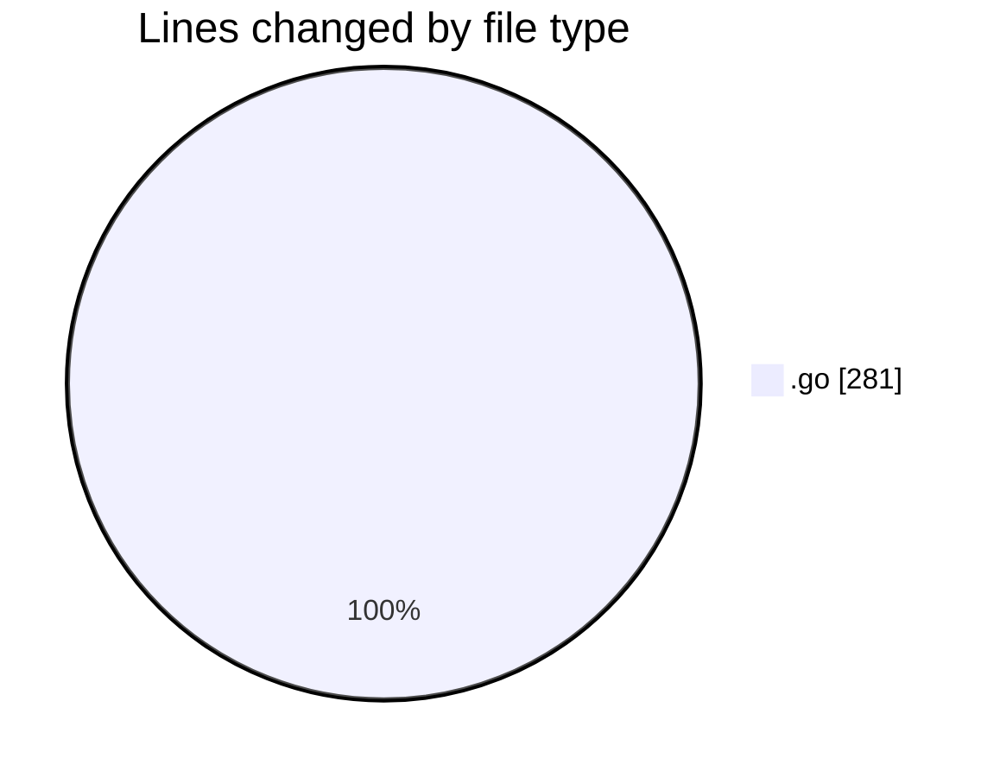

# backend - Activity Summary 

## Overall Statistics

| Stat                   | Value                                                             |
| ---------------------- | ----------------------------------------------------------------- |
| **Lines Added** (➕)   | 204                                          |
| **Lines Removed** (➖) | 77                                        |
| **Net Change** (↕)    | 127                |
| **Active Time** (⌚)   | 14 minutes |

## Modified Files
- **main.go** (+123, -77)
- **config.go** (+31, -0)
- **logger.go** (+11, -0)
- **handler.go** (+22, -0)
- **handler.go** (+17, -0)

## Visualizations

### By File Type (Lines Changed)

### By Hour (Estimated Activity Count)

> **Last Updated:** 10/31/2025, 9:26:28 PM