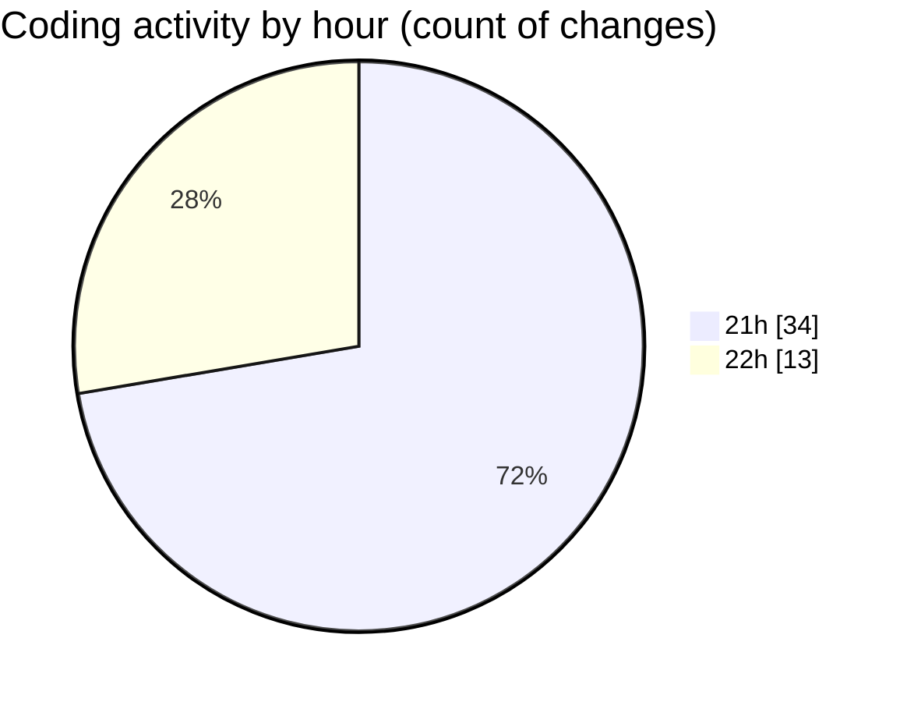

# backend - Activity Summary 

## Overall Statistics

| Stat                   | Value                                                             |
| ---------------------- | ----------------------------------------------------------------- |
| **Lines Added** (➕)   | 590                                          |
| **Lines Removed** (➖) | 312                                        |
| **Net Change** (↕)    | 278                |
| **Active Time** (⌚)   | 61 minutes |

## Modified Files
- **main.go** (+196, -141)
- **config.go** (+33, -0)
- **logger.go** (+11, -0)
- **handler.go** (+215, -151)
- **handler.go** (+17, -0)
- **.air.tomb** (+14, -1)
- **.air.toml** (+43, -16)
- **.env** (+27, -0)
- **.gitignore** (+23, -1)
- **go.mod** (+11, -2)

## Visualizations

### By File Type (Lines Changed)

### By Hour (Estimated Activity Count)

> **Last Updated:** 10/31/2025, 10:51:28 PM